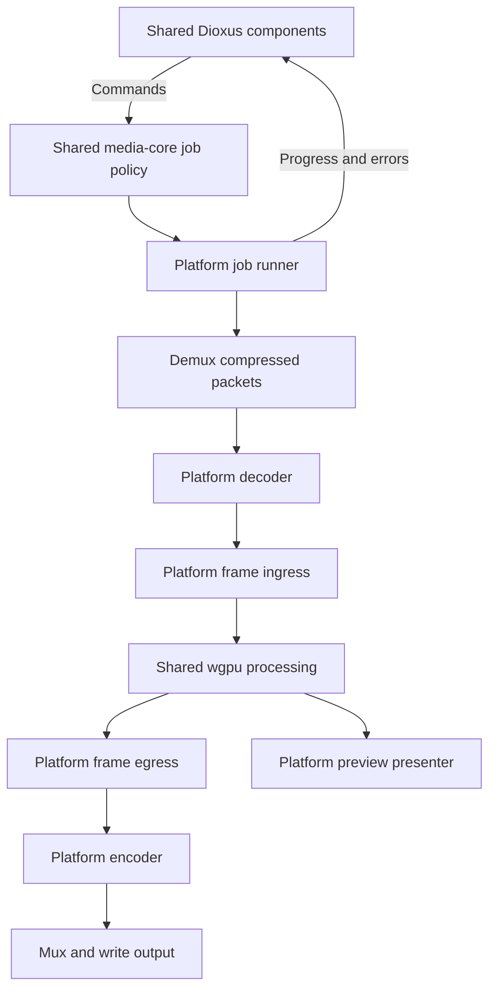

# GPU video converter: architecture and development plan

Status: design researched 2026-09-15; M3.3 acceptance passed on 2026-09-19 for Firefox's enabled WebM profiles and all three profiles in Chromium, through worker and fallback paths. M3.4 has not started. See [interop-report.md](interop-report.md) for milestone-specific evidence and limitations.

## 1. Architecture

### Core decisions

1. Use Dioxus for controls and job status. Launch with Dioxus Web; add Dioxus Native/Blitz later.
2. Share media types, job policy, transformation descriptions, wgpu pipelines, and WGSL between browser and native builds.
3. Put decoding, encoding, frame import/export, file access, and presentation behind platform boundaries.
4. Treat codecs and GPU processors as separate services. A GPU shader does not replace a video encoder.
5. Use one processing device and queue per execution context. Keep browser codecs and processing together in a dedicated worker when its capability probe succeeds, with an explicit main-thread compatibility fallback.
6. Target no application-managed CPU pixel round trips in the browser fast path. Track explicit copies and qualify claims about browser internals.
7. Build a linear pipeline first. Defer a general render graph, plugins, timeline editing, and multi-job scheduling.

### Data flow



The diagram describes data flow, not crate dependency direction. `media-core` never imports a platform backend. The host composes platform services and drives shared policy.

WebCodecs operates on compressed chunks and frames; container parsing/writing is a separate concern. Its frame constructor accepts canvas image sources rather than an arbitrary wgpu texture, so canvas-based output is an interoperability experiment to validate. [WebCodecs specification](https://www.w3.org/TR/webcodecs/)

### Browser frame path

Firefox compatibility correction (2026-09-19): direct VideoFrame copying is attempted through the processing queue/texture's released wgpu `as_webgpu` handles in a catchable browser adapter. If source conversion throws TypeError, use createImageBitmap(VideoFrame), copy that image on the same device, retain it through GPU completion, and close it explicitly. This fallback was validated in Firefox 156 with M1 correctness and M3.2 WebM conversion/cancel/restart. Count the additional bitmap conversion per frame; no CPU pixel readback is added and internal copies remain unknown. Other copy errors propagate as job failures. This avoids a wgpu JavaScript exception becoming an unrecoverable Rust panic.

Baseline to prove first:

```text
compressed fixture packets
  → WebCodecs VideoDecoder
  → owned VideoFrame
  → wgpu Queue::copy_external_image_to_texture
  → ordinary RGBA wgpu texture
  → shared WGSL resize pass into a WebGPU canvas surface
  → new VideoFrame(canvas, timestamp/duration)
  → WebCodecs VideoEncoder
  → compressed output packets
```

The published wgpu WebAssembly API documents `ExternalImageSource::VideoFrame` and `Queue::copy_external_image_to_texture`. This is the baseline ingress candidate; successful compilation alone does not establish runtime support or copy behavior. [ExternalImageSource](https://docs.rs/wgpu/latest/wasm32-unknown-unknown/wgpu/enum.ExternalImageSource.html), [Queue API](https://docs.rs/wgpu/latest/wasm32-unknown-unknown/wgpu/struct.Queue.html#method.copy_external_image_to_texture)

Prefer a render pass for the first resize: it can write directly to the canvas attachment and works with the native version of the same shader. Keep the resize code independent of the surface. Later, use pooled offscreen outputs for multiple operations and add a final presentation/export pass. Do not require compute shaders for every operation.

For the copy baseline, validate an `Rgba8Unorm` input texture with `COPY_DST | TEXTURE_BINDING | RENDER_ATTACHMENT` usage against the selected API. Choose the output format from surface capabilities and build the render pipeline for that format; do not assume RGBA/BGRA interchangeability or storage-texture support on a canvas. M1 uses explicit sRGB boundary settings and opaque alpha, with bilinear resizing of sRGB-encoded channel values as a documented prototype limitation. Production linear-light filtering and wider color support belong to M3.

For the canvas handoff, acquire the current surface texture, render and submit, then follow the ordering validated for the pinned wgpu/browser integration without an unrelated await, animation callback, or canvas resize. With wgpu 30.0.1 and Edge 153, capturing before releasing/presenting the surface texture caused Chromium to report an uninitialized 160×90 shared image, while holding that texture through the completion wait eventually back-pressured the surface. M1 therefore uses `submit → present/release → VideoFrame(canvas) → submitted-work completion` with a persistent export canvas whose backing dimensions equal encoded dimensions. Both frame handles remain alive through completion. CSS size and UI layout must not change it. Test `HTMLCanvasElement` first; investigate `OffscreenCanvas` during worker migration only after M1.

Optimization candidate:

```text
VideoFrame → external-texture import → normalization/resize pass → output
```

Development wgpu documentation shows `Device::import_external_texture`, while the published 30.0.1 device page inspected for this plan did not list it. `create_external_texture` takes existing texture planes and is a different operation. Check the exact selected release, target features, and source before using direct import. Do not assume development documentation describes a released crate. [Development device source](https://wgpu.rs/doc/src/wgpu/api/device.rs.html), [Published Device API](https://docs.rs/wgpu/latest/wasm32-unknown-unknown/wgpu/struct.Device.html)

If direct import is unavailable, retain the baseline copy path. Do not create an independent JavaScript WebGPU device and assume its textures can be used by wgpu. Any future JavaScript bridge must use the same underlying device and documented interoperability APIs, stay inside the browser adapter, and preserve the shared processing code.

### What “minimize copies” means

| Boundary | Intended behavior | What must be measured |
|---|---|---|
| File → compressed packets | CPU bytes are expected | Streaming/buffering cost |
| Decoded VideoFrame → texture | Browser-managed image copy; direct import later | Conversion cost and hidden staging |
| GPU operation → next operation | GPU textures, pooled when needed | Pass count, bandwidth, allocation count |
| Processed canvas → encoder frame | Browser-managed snapshot/handoff | Hidden copy, synchronization, color conversion |
| Encoder → compressed bytes | CPU bytes are expected | Output buffering |
| GPU frame → diagnostic pixels | Test-only readback | Separately counted and excluded from throughput timings |

WebGPU allows an external texture to wrap a frame without a copy, but does not guarantee that implementation choice. External textures are sampleable snapshots, not writable storage textures. Closing their source `VideoFrame` expires them. Color conversion at WebGPU external-image boundaries also needs explicit attention. [WebGPU specification](https://www.w3.org/TR/webgpu/)

Call the proposed baseline “no explicit CPU pixel readback,” not “zero-copy.” Browser profiling may support narrower claims for a specific browser, GPU, and codec. It cannot turn an opaque handoff into a universal guarantee.

### Lifetime, scheduling, and correctness

- Wrap each browser frame with explicit `close()` and a Rust `Drop` safety net; do not rely on JavaScript garbage collection. Do not expose freely clonable frame owners.
- Give textures a device-generation identifier and pool lease. Never reuse a texture until its GPU work and downstream consumer have released it.
- Keep the decoded source frame and canvas snapshot alive through the submission-specific completion point. Present/release the acquired surface texture before snapshot construction; retaining the surface through the wait caused back-pressure in Edge 153. Do not weaken these lifetimes without repeating the full interop test.
- After `VideoEncoder.encode` accepts an output frame, close the application's frame handle; the encoder retains its own resource reference. Handle synchronous exceptions and asynchronous codec errors. [WebCodecs encoder and resource model](https://www.w3.org/TR/webcodecs/)
- Milestone 1 allows one processed frame in flight. Bound codec submissions and callback queues separately; do not accumulate an entire decoded clip.
- Later use a small credit-based pool, initially three frames. Reserve downstream capacity before feeding more decoder input. `decodeQueueSize` and `encodeQueueSize` alone do not account for every retained frame or pending GPU operation.
- Input pumping and output draining run concurrently. Never wait for one decoded output per submitted packet: codecs can buffer frames. At end of stream, flush the decoder while draining callbacks, finish GPU/export work, flush the encoder while draining output, then finalize the muxer.
- Preserve every frame for offline conversion; preview may sample/drop frames independently. Conversion must not be driven by display refresh rate.
- Carry integer timestamps with rational time bases, frame duration, coded/display sizes, visible rectangle, orientation, and color metadata. Distinguish presentation timestamps from decode timestamps. Convert to WebCodecs microseconds with checked arithmetic and an explicit rounding policy.
- Cancellation stops input, invalidates old callbacks with a job generation, closes queued resources, and discards incomplete output. GPU work already submitted may finish; cancellation must not destroy resources still in use.
- Handle device loss as a failed job with cleanup and an explicit restart path initially. Automatic checkpoint recovery comes later.

### Native rendering and codecs

Dioxus documents `desktop` as a webview renderer and `native` as its experimental Blitz-based renderer. Use the latter for the eventual native UI requirement. Blitz's repository describes ongoing beta development. [Dioxus renderer documentation](https://dioxuslabs.com/learn/0.7/beyond/project_structure/), [Blitz repository](https://github.com/DioxusLabs/blitz)

Do not couple processing to Blitz's internal renderer. Define a preview presenter adapter. First prove native conversion with a headless harness, then integrate a preview surface or a documented shared-device texture path with Blitz. UI and processing using wgpu does not imply that they use the same device or compatible crate versions.

Defer codec selection until the native phase. A software FFmpeg/library backend can establish correctness with explicitly counted uploads/readbacks. Hardware interop then requires a separate platform spike: Windows decoder surfaces may require D3D11/D3D12 sharing, macOS uses platform surface handles, and Linux uses external-memory handles. Adapter identity, fences, plane formats, and resource ownership belong in native ingress/egress, not in WGSL or `media-core`. These are candidate integration directions, not promised portable APIs.

## 2. Rust workspace layout

Create only the four M1 crates initially. Add later crates when the phase needs them.

```text
video-converter/
├── Cargo.toml                 # workspace, shared dependencies, resolver
├── Cargo.lock                 # committed application dependency resolution
├── rust-toolchain.toml        # pinned compatible toolchain + wasm target
├── AGENTS.md
├── README.md
├── apps/
│   ├── web/                   # M1: Dioxus Web launcher and tiny probe UI
│   └── native/                # later: Dioxus Native/Blitz launcher
├── crates/
│   ├── media-core/            # M1: pure Rust metadata and job rules
│   ├── media-gpu/             # M1: shared wgpu processor and WGSL
│   ├── media-web/             # M1: WebCodecs + browser frame bridge
│   ├── ui/                    # M2: extracted shared Dioxus components
│   ├── media-container/       # M2: container adapters
│   └── media-native/          # later: codec + native frame bridge
├── fixtures/                  # small reproducible, redistributable assets
│   └── README.md              # generation method, metadata, hashes/license
└── docs/
    ├── architecture.md
    ├── first-implementation-prompt.md
    ├── interop-report.md      # produced by M1, actual measured results
    └── adr/                   # significant decisions once tested
```

M1 package names: `converter-web`, `media-core`, `media-gpu`, `media-web`.

Use one selected wgpu version in workspace dependencies. Keep renderer and operating-system dependencies target-specific; avoid a universal `--all-features` build that accidentally selects incompatible renderers. Pin a released compatible Dioxus/wgpu/wasm-bindgen/web-sys set after a compile probe; no exact version combination is asserted by this design. Record any required binding flags rather than applying unstable settings globally without explanation.

## 3. Crate responsibilities and dependencies

| Crate | Owns | Dependencies / boundaries |
|---|---|---|
| `media-core` | Time bases, frame/packet metadata, operation specs, capability models, errors, job state and backend contracts | No Dioxus, wgpu, web-sys, codec FFI, DOM, filesystem, or executor dependency |
| `media-gpu` | Device context, texture leases, GPU frame representation, WGSL, pipelines, submission/completion tracking | `media-core`, wgpu; no browser codec or UI types |
| `media-web` | WebCodecs config/callbacks, owned VideoFrames, GPU ingress/egress, browser job runner and capability probes | `media-core`, `media-gpu`, wasm-bindgen/web-sys; narrowly scoped JS glue if necessary |
| `media-container` | Stream descriptions, demux/mux adapters, codec initialization data, packet ordering and container time conversion | `media-core`; wrap a proven library rather than write a general MP4 parser |
| `media-native` | Native codec runtime, CPU fallback, hardware-surface ownership and synchronization, native runner | `media-core`, `media-gpu`, optional platform codec dependencies |
| `ui` | Reusable Dioxus controls, settings forms, progress and error views | `media-core`, Dioxus; commands/events through injected service handles |
| `apps/web` | Dioxus Web startup, canvas mounting, browser source/sink selection, service wiring | Web adapter, later shared `ui` and container adapter |
| `apps/native` | Dioxus Native startup, native source/sink dialogs, preview integration, service wiring | Native adapter, shared `ui`, container adapter |

Keep browser-specific container-library glue inside `media-web` if the selected demux/mux library is JavaScript. Share the packet and track contracts without forcing all platform libraries into one crate. The native backend may use the container facilities of its codec library through the same contracts.

Move the probe UI into `ui` only when reusable controls exist. Avoid empty crates and speculative abstractions in M1.

## 4. Key traits and interfaces

The following are design sketches, not a compile-ready API or instructions to implement every trait in M1. Start with concrete browser adapters; extract interfaces as a second implementation or meaningful test requires them.

### Core data contracts

```rust
pub struct TimeBase {
    pub numerator: u32,
    pub denominator: u32, // validated nonzero
}

pub struct Timestamp {
    pub ticks: i64,
    pub time_base: TimeBase,
}

pub struct FrameMeta {
    pub pts: Timestamp,
    pub duration: Option<Timestamp>, // validated nonnegative
    pub coded_size: Size,
    pub visible_rect: Rect,
    pub display_size: Size,
    pub orientation: Orientation,
    pub color: ColorInfo,
}

pub struct Frame<T> {
    pub meta: FrameMeta,
    pub storage: T, // owned resource; no mandatory Clone or Send
}

pub struct EncodedPacket {
    pub track: TrackId,
    pub pts: Timestamp,
    pub dts: Option<Timestamp>,
    pub duration: Option<Timestamp>,
    pub keyframe: bool,
    pub data: Vec<u8>, // compressed bytes, not raw frame pixels
}
```

`Size`, `Rect`, `Orientation`, `ColorInfo`, and `TrackId` are validated domain types. Color metadata includes primaries, transfer function, matrix, range, and alpha interpretation; unknown values stay unknown until a documented policy resolves them. Put codec configuration/extradata in a separate stream event; packets must not silently discard configuration changes. WebCodecs output does not directly provide a general container DTS solution; M2 must choose a supported packet-order/timestamp policy and reject streams it cannot mux correctly.

### Asynchronous codecs

```rust
// Sketch using futures Sink/Stream; the traits themselves impose no Send bound.
pub trait DecoderBackend {
    type Storage;
    type Input: Sink<DecodeCommand, Error = MediaError>;
    type Output: Stream<Item = Result<DecodeEvent<Self::Storage>, MediaError>>;

    fn open(&self, config: DecodeConfig)
        -> Result<(Self::Input, Self::Output), MediaError>;
}

pub trait EncoderBackend {
    type Storage;
    type Input: Sink<EncodeCommand<Self::Storage>, Error = MediaError>;
    type Output: Stream<Item = Result<EncodeEvent, MediaError>>;

    fn open(&self, config: EncodeConfig)
        -> Result<(Self::Input, Self::Output), MediaError>;
}
```

`DecodeCommand` contains packet, end-of-stream, and abort commands. `DecodeEvent` contains frame, configuration-change, and drained events. `EncodeCommand` contains frame/options, end-of-stream, and abort commands; `EncodeEvent` contains configuration, packet, and drained events. Input readiness reflects bounded capacity. An accepted command transfers ownership; errors/drop paths release it. Both halves run concurrently. A drained event means all output callbacks for the end-of-stream operation have been delivered, not merely that a queue counter reached zero. Define `Sink::flush` as command transport flushing; explicit end-of-stream controls codec draining.

Split input/output avoids the deadlock-prone `decode(packet).await -> one frame` model. Native ports may add `Send` when moved between native threads; browser ports stay local. No `unsafe impl Send` for browser handles and no mandatory Tokio runtime in shared code.

### GPU bridge and processor

```rust
// media-gpu: these contain no web_sys or native codec types.
pub struct GpuFrame {
    pub meta: FrameMeta,
    pub storage: TextureLease,
    pub device_generation: DeviceGeneration,
}

pub struct ImportedFrame<G> {
    pub gpu: GpuFrame,
    pub keep_alive: G, // preserves decoder/import resource lifetime
}

// Implemented by platform adapters. Local futures are deliberate.
pub trait FrameBridge {
    type Decoded;
    type Encodable;
    type ImportGuard;

    fn import(&mut self, input: Frame<Self::Decoded>, gpu: &GpuContext)
        -> Result<ImportedFrame<Self::ImportGuard>, MediaError>;

    async fn export(&mut self, input: GpuFrame, gpu: &GpuContext)
        -> Result<Frame<Self::Encodable>, MediaError>;
}

// Prefer a concrete shared processor until there are multiple processors.
impl GpuProcessor {
    pub fn record_resize(
        &self,
        commands: &mut wgpu::CommandEncoder,
        source: &wgpu::TextureView,
        target: &wgpu::TextureView,
        operation: &ResizeSpec,
    ) -> Result<(), MediaError>;
}
```

`TextureLease`, `GpuContext`, and `DeviceGeneration` encapsulate allocation, device identity, and completion tracking. The job runner retains `ImportedFrame` guards until the submission is safe to release and retires output leases only after export has consumed them. `export` must retain its input across any asynchronous work and perform canvas render/submit/capture as an uninterrupted sequence internally. It cannot treat arbitrary textures as encoder frames.

For M1, call `record_resize` directly with the canvas target to avoid an unnecessary intermediate. The general `export(GpuFrame)` path is for later pooled processing outputs. A future external-texture ingress may normalize to a regular texture or use a dedicated sampling entry point; shared transform math should remain common.

Other contracts, added when needed:

- `Demuxer`: stream configuration plus ordered `EncodedPacket` events, with seeking optional.
- `Muxer`: consume configuration/packet events and finish through an injected byte sink.
- `ByteSource` / `ByteSink`: bounded reads/writes; filesystem and browser handles remain outside core.
- `PreviewPresenter`: consume a GPU output through a platform adapter without forcing CPU images into Dioxus state.
- `JobCommand` / `JobEvent`: start, cancel, progress, failed, completed; updates are throttled and contain metadata rather than frames.
- `BackendCapabilities`: exact codec/config support, GPU limits, supported bridge paths, copy classification, and acceleration preference with actual hardware use marked unknown when unobservable.

## 5. Phased implementation roadmap

### M1 — browser round-trip experiment

**Question:** Can the selected Rust/browser stack decode a frame, resize it with shared wgpu code, and encode the result without application-managed CPU pixel readback?

**Scope:** one tested Chromium-based browser, one fixed video codec (try VP8), opaque SDR, 320×180 input, 160×90 output, 30 numbered frames, no audio, no general file picker, no container muxing, no native application.

Use a checked-in tiny compressed fixture with a packet manifest containing timestamps, durations, keyframe flags, and codec configuration. Include colored areas, orientation markers, and changing frame identifiers. A raw compressed-packet fixture avoids a demuxer dependency. Fixture generation happens separately and is documented; it must not replace testing actual `VideoDecoder` output.

Implementation order:

1. Pin a compatible released toolchain/dependency set. Build the four small crates for their intended targets.
2. Create a Dioxus Web page with Run, Cancel, a canvas, and concise status. Probe secure context, WebGPU, exact decoder/encoder configs, canvas capture, and selected ingress API. Report unsupported configurations explicitly.
3. Decode one fixture frame, copy it into a wgpu texture, resize with shared WGSL, and render to the canvas.
4. Capture the rendered canvas as a timestamped VideoFrame; encode it and collect compressed output. This is the critical gate, not just displaying decoded video.
5. Process all 30 frames with one processing slot, bounded input/callback queues, explicit ownership, end-of-stream draining, and cancellation cleanup.
6. Decode the encoded result again using the returned codec configuration. Check dimensions, frame count, timestamps, markers, and representative colors. Test-only readback is allowed in this verification step and measured separately.
7. Produce `docs/interop-report.md` with tested environment, pinned versions/features, API path, synchronization sequence, queue/live-frame high-water marks, observed timings, and unresolved limitations.

**Acceptance gates:**

- A real browser run successfully decodes → resizes → encodes → re-decodes all 30 frames; no black/stale/repeated output. Counts refer to decoded frames, not an assumption that packets always map one-to-one.
- Encoded output is 160×90; expected timestamps/durations are preserved within the declared conversion precision. Use codec-tolerant pixel thresholds and marker checks, not byte-identical video comparisons.
- The conversion path does not call `VideoFrame.copyTo`, `getImageData`, GPU readback mapping, or readback followed by `write_texture` for frame pixels. Uniform uploads and compressed packet copies are fine.
- Explicit copy counters, retained-frame counts, and peak queue lengths are reported. Do not claim knowledge of hidden browser copies.
- Five repeated runs and cancellation/restart return application-owned live frames to zero after cleanup, without validation errors or unbounded queue growth. Long-run memory profiling is M3.
- Failure to obtain WebGPU or a supported codec reports a clear reason. GPU or codec failure does not leave a permanently running job.
- A host check of `media-core` and `media-gpu` proves basic portability; an actual browser run proves interop. Neither substitutes for the other.

Do not impose a real-time throughput target on this correctness spike. Record a baseline. Try direct external-texture import only as a small optional comparison after the baseline works with a documented released API. If canvas export fails or requires explicit CPU readback, document the result and stop expansion until the architecture decision is revisited; displaying a preview is not a passing substitute.

### M2 — smallest usable browser converter

Implementation status (2026-09-18): the measured M2 path is MP4/H.264 input to video-only WebM/VP8 output using Mediabunny 1.58.0 for demux/mux and WebCodecs orchestration. The sole resize preset is half width and height with even codec dimensions. Input is capped at 256 MiB and output uses an in-memory buffer; audio is detected, prominently reported, and omitted. Rotation/flip metadata is rejected rather than silently lost. Streaming, audio processing, and broader format support remain M3 or later work.

- One input/output container and codec combination, selected from measured support; video-only with a clear audio warning.
- Integrate a proven demux/mux implementation. Handle codec initialization metadata, keyframes, timestamp rescaling, and output finalization.
- File selection, one resize setting, progress, cancellation, and a downloadable playable output.
- Keep small-file size/memory limits explicit until streaming output exists.
- Extract reusable Dioxus components into `ui`; keep canvas mounting platform-specific.
- Validate exported files with an independent player/inspector, including duration and seeking. No dropped video frames.

### M3 — throughput, color, and browser robustness

M3 is split into ordered, independently releasable sub-milestones. Do not begin a later sub-milestone until the preceding acceptance gate is recorded in `docs/interop-report.md`. Each profile binds its container, video codec, audio codec/policy, extension, and muxer settings; the UI must never offer an invalid combination or silently substitute another profile.

#### M3.1 — output-profile model and audio-preserving WebM

Implementation status (2026-09-18): the preferred `WebmVp8Opus` profile and the explicit `WebmVp8VideoOnly` profile are implemented. `media-core` owns the profile/audio policy and exact-reason capability result; `media-web` owns the exercised local `BrowserConversionBackend` contract and its `WebCodecsMediabunnyBackend`; JavaScript at that boundary contains the concrete Mediabunny input/output adapters and the browser job orchestrator. Audio and video pumps run concurrently with awaited per-track backpressure, one shared integer-microsecond origin, ordered end-of-stream finalization, and sibling failure/cancellation cleanup. The more granular `DecoderBackend`/`EncoderBackend`/`FrameBridge` examples above remain design sketches until an actual alternative backend requires those seams; promoting them now would create unexercised interfaces, contrary to the repository rule. M3.2 subsequently reused these contracts without duplicating job policy.

- Add platform-neutral output-profile and audio-policy types to `media-core`, plus capability results that carry an exact unsupported reason.
- Turn the existing `DecoderBackend`, `EncoderBackend`, packet/track, and `FrameBridge` sketches into the smallest real contracts needed by a second codec implementation. Keep command/event draining, ownership, cancellation, timestamps, and capability reporting independent of WebCodecs, FFmpeg, containers, Dioxus, and wgpu. Browser futures may remain non-`Send`; do not introduce Tokio, threads, or unsafe `Send`/`Sync` implementations.
- Split the current hard-coded M2 runner into a browser job orchestrator plus concrete `WebCodecs` codec and Mediabunny container adapters. Preserve the proven M2 behavior before adding another backend; avoid an abstract factory hierarchy or interfaces without an exercised implementation.
- Replace the fixed output label with a reusable profile selector. Retain an explicit video-only WebM/VP8 profile and add WebM/VP8/Opus as the preferred audio-preserving profile when the exact browser configuration is supported.
- For MP4/AAC input, decode audio and encode Opus while video uses the existing wgpu path. Passthrough is allowed only when the source codec/configuration is already compatible with the chosen container.
- Bound audio decode/encode callbacks independently, preserve integer timestamps and durations, define start-offset/end-of-stream policy, and clean up both tracks on cancellation or failure.

**Acceptance gate:** the deterministic H.264/AAC fixture exports a WebM containing all 60 VP8 frames and an Opus track; independent inspection/player tests verify duration, seeking, audible output, and A/V synchronization near the beginning, midpoint, and end. The WebCodecs/Mediabunny implementation runs through the new backend/orchestrator contracts; video-only selection, cancellation/restart, and the M1 probe still pass without duplicated job policy.

#### M3.2 — real output-container choice

Implementation status (2026-09-18): `Mp4H264Aac` is implemented as a complete profile alongside both WebM profiles. File selection probes the exact half-size H.264 frame geometry/rate and 48 kHz AAC channel configuration; the selector enables MP4 only when both probes pass and otherwise displays the exact failed reason. The concrete output adapter selects either WebM or fast-start MP4 while the shared job orchestration, audio/video pumps, timing origin, cancellation, GPU processor, and verification policy remain common. The deterministic fixture and an additional 147-second stereo input passed browser and FFmpeg inspection. M3.3 has not started.

- Probe an MP4/H.264/AAC encode profile using exact `VideoEncoder` and `AudioEncoder` configurations plus the selected muxer. Show it disabled with the failed capability when any required part is unavailable.
- Enable MP4 only after the tested browser produces a finalized, seekable file with correct codec initialization records, keyframes, frame/sample counts, duration, and A/V synchronization.
- Keep WebM and MP4 settings isolated behind concrete profiles; do not create an arbitrary container/codec mix-and-match UI.

**Acceptance gate:** the selector offers both WebM and MP4 on a browser that passes both capability probes, or visibly explains why MP4 is unavailable. Every enabled profile passes independent player/inspector validation with no dropped video frames or audio samples outside the declared encoder-padding tolerance.

#### M3.3 — worker migration

Implementation status (2026-09-19, superseding the earlier M3.2 status): acceptance passed in Firefox 156 for both enabled WebM profiles and in Edge/Chromium 153 for all three profiles, including MP4/H.264/AAC. Worker and explicit main-thread paths passed conversion, cancellation/restart, lifecycle counters, playback and five repeated M1 correctness checks per path. A real Chromium test also injected worker-constructor failure and verified visible automatic fallback with all three profiles. Independent FFmpeg inspection passed frame/audio counts, audio seeks and MP4 fast-start layout; the pre-existing Opus header warning remains documented. The user supplied an isolated Chromium debugging session to resolve the earlier launch restriction. Firefox still disables MP4 because its exact AAC encoder probe fails. M3.4 has not started.

The `media-web` module worker imports the same Dioxus-produced wasm bundle; app startup mounts Dioxus only when `document` exists. No second Rust build or duplicate processor is maintained. wasm-bindgen copies `worker-host.js` as a local module snippet; it resolves the pinned Dioxus `wasm/converter-web.js` layout relative to the inline binding. The hashed codec-script URLs are supplied by `asset!`, not guessed by the worker. Renaming the app or changing the bundler layout requires updating/testing that resolver. The worker pays for a second wasm instance including currently unused UI code; bundle splitting is not part of this correctness milestone.

One platform-owned preview canvas is transferred once during startup. Rust creates the real device/surface on this OffscreenCanvas, probes VideoFrame capture, then reuses the same session for capability probes, conversion, and M1. The HTML canvas is retained separately for fallback. Both variants use the same resize pipeline, ingress, render/present/capture order and GPU-completion guards; raw frames never cross to the window or enter Dioxus signals. A completed compressed Blob crosses back to the window, which owns/revokes its download URL.

Startup checks secure context, worker codec APIs, WebGPU, OffscreenCanvas, device/surface creation, and capture, with a 30-second startup timeout. Exact profile probes run in the selected execution context. Failure before startup selects the main-thread path with its reason displayed; `?execution=main` explicitly selects that path for comparison. Runtime job errors do not silently rerun on the main thread. Transport errors terminate the failed context, reject pending work, and permit a fresh worker on the next request. Commands are serialized and tagged; cancellation invalidates queued jobs and drains the active codec job. Late progress is ignored. Cancellation during startup prevents a job from starting once the bounded startup probe finishes. There is no general hung-codec/device watchdog yet.

Application-held frame-reference/sample counts cover the conversion pumps and return to zero on completion and cancellation. Closed references retained until their `finally` block are conservatively counted; these are not internal codec queue or GPU-memory measurements. M1 retains its separate live-frame/callback instrumentation. Fine-grained bounds, pool telemetry and throughput work remain M3.4.

- Move demux/codec orchestration and wgpu processing into one dedicated worker so frame handles remain in that execution context.
- Probe worker WebGPU, WebCodecs, and `OffscreenCanvas` before enabling the worker path. Retain the measured main-thread implementation as an explicit compatibility fallback.
- Use structured job commands and metadata/progress events only; do not send raw frames or GPU handles through Dioxus state.

**Acceptance gate:** both worker and fallback paths pass every enabled output profile, cancellation/restart, lifecycle counters, and M1 correctness checks. The UI remains responsive during conversion, and fallback reasons are visible.

#### M3.4 — bounded throughput and resource reuse

- Add separately bounded decoder submissions, decoded callbacks, GPU processing, audio queues, encoder submissions, and mux writes.
- Add device-generation-aware texture pools, allocation/live-resource telemetry, copy counters, and long-running tests. Separate CPU submission latency from GPU execution time; use GPU timestamp queries only when supported.
- Compare WebCodecs `hardwareAcceleration: "no-preference"` with `"prefer-hardware"` for every enabled output profile using exact decoder and encoder capability probes. Keep `"no-preference"` as the compatibility baseline; use `"prefer-hardware"` only when the complete profile remains supported and measured results justify it. Fall back visibly rather than failing the job or silently changing codecs.
- Measure end-to-end throughput, startup latency, CPU load, power where observable, output correctness, and stability. Treat the preference as a browser hint: neither successful configuration nor the displayed wgpu adapter proves which codec implementation or GPU WebCodecs used.
- Compare the baseline external-image copy with direct external import only if a released API supports it. Measure both ingress and egress before claiming a gain.

**Acceptance gate:** repeated short jobs and at least one long input show stable queue/resource high-water marks, zero application-owned live frames after cleanup, no premature texture reuse, and no regression in output correctness. The interoperability report records both hardware-preference configurations for each enabled profile, including unsupported results and measured tradeoffs; any automatic preference decision has a tested `"no-preference"` fallback. Report throughput as measurements, not a real-time or hardware-execution guarantee.

#### M3.5 — geometry, timing, and color correctness

- Define the SDR color pipeline and metadata policy, then implement crop, pixel-aspect ratio, rotation, and flip instead of rejecting them.
- Add variable-frame-rate, non-zero-start, orientation, and color fixtures. Define and test the mid-stream resolution-change policy.
- Continue rejecting HDR until transfer functions, gamut mapping, metadata, and output profiles are implemented and independently verified.

**Acceptance gate:** metadata-rich fixtures pass orientation/crop, per-frame timestamp, duration, seek, representative color, and A/V synchronization checks in every enabled profile. Unsupported HDR and resolution changes fail clearly rather than producing altered output.

#### M3.6 — streaming, compatibility matrix, and recovery

- Replace the in-memory output target and 256 MiB input policy with bounded streaming where browser file APIs permit it; retain a clearly labeled memory fallback.
- Expand the measured browser/input/output matrix one profile at a time. Additional WebM codecs such as VP9 or AV1 are added only as complete, capability-probed profiles.
- Handle device loss and codec failure by stopping input, draining/closing owned resources, invalidating the device generation, and allowing a clean restart or documented fallback.

**Acceptance gate:** an input larger than the former limit completes without retaining the entire input or output in application memory; the compatibility report lists exact tested browser/profile combinations; injected failure and available device-loss tests return owned resources to zero and permit restart.

#### M3.7 — conditional FFmpeg WASM backend spike

- Add FFmpeg WASM only when a measured browser compatibility gap or requested codec/profile justifies its download size, startup cost, memory use, and maintenance burden. Implement it as an alternative browser codec/container backend, preferably in a worker, behind the M3.1 contracts; do not put it in `media-native` or duplicate shared job policy.
- Keep the shared wgpu processor only when the FFmpeg WASM frame bridge can be implemented correctly. Count and report every explicit WASM-memory copy, CPU pixel upload, and GPU readback; a software encoder path that requires GPU readback is a compatibility fallback and must not inherit the WebCodecs path's no-explicit-readback claim.
- Select backends from exact profile capabilities and an explicit user/developer preference. Never silently switch codecs, containers, quality settings, or processing implementations when falling back.

**Acceptance gate:** at least one justified output profile completes through both WebCodecs and FFmpeg WASM using the same job/profile policy; independent output checks pass; cancellation returns owned frames and WASM resources to zero; startup, throughput, peak memory, bundle/download size, and copy counts are recorded side by side. If the spike is not justified or fails its resource/correctness gate, document the result and retain WebCodecs without blocking M4.

Core M3 browser robustness is complete when M3.1 through M3.6 pass. M3.7 is a conditional compatibility extension and is not required to begin M4. Partial completion must be reported by sub-milestone number and must not be presented as completion of all browser robustness work.

### M4 — native correctness using shared processing

- Choose one OS and one codec library first. Implement native FFmpeg (or the selected native library) behind the M3.1 codec/container/backend contracts in `media-native`, and add a headless conversion harness before UI integration. Reuse shared job/profile policy rather than forking the browser orchestrator.
- Enumerate native wgpu adapters and expose stable descriptors (name, vendor/device IDs, device type, backend, and PCI bus identity when available). Allow the harness to select an exact adapter; never identify adapters by enumeration index alone.
- Persist a preferred adapter descriptor, re-resolve it on each launch, and report a clear fallback when it is disconnected or no longer compatible. Adapter selection must happen before codec/surface/device creation.
- Treat an adapter change as a new device generation: stop accepting work, cancel and drain the active job, retire old textures only after submitted work completes, then recreate the device, queue, pools, pipelines, codec bridges, and preview surfaces. Resources from different generations are never interchangeable.
- Use the same `media-core` rules, resize shader, GPU processor, ownership/drain semantics, and capability model. A software codec path with counted CPU↔GPU frame transfers is acceptable to establish correctness.
- Verify native output against the same fixtures and timing/color expectations. Keep platform feature flags isolated from WASM builds.

### M5 — Dioxus Native/Blitz and hardware interop

- Add native Dioxus launcher, shared controls, and native source/sink handling.
- Add a native GPU selector backed by the M4 adapter descriptors. Display the active adapter and disable switching while teardown/recreation is incomplete; browser builds continue to display the browser-selected adapter without claiming exact-selection control.
- Prove preview integration independently: compatible device/version sharing or a documented surface/compositor path. Preview must not force conversion through a CPU image format.
- Optimize native decode and encode surfaces one OS at a time; include synchronization and same-adapter validation, not just imported handles.
- Benchmark complete conversion including both bridges. Retain an explicit CPU fallback when hardware interoperability is unavailable.

## 6. Technical risks

| Risk | Impact | Mitigation / earliest evidence |
|---|---|---|
| wgpu release/feature mismatch | Code written from development docs does not build | Pin dependencies and compile actual frame-copy calls in M1 |
| Canvas snapshot timing or compatibility | Blank/stale frames or inability to encode GPU output | M1 full round trip and changing frame markers |
| Hidden GPU↔CPU staging | Correct output but poor throughput | Avoid explicit readbacks; profile both bridges; report unknown internal behavior |
| Hardware acceleration assumptions | Codec support succeeds using software | Treat acceleration as a preference and report uncertainty |
| Premature close/reuse | Validation errors, corruption, decoder stalls | Owned frame guards, submission tracking, cancellation tests |
| Codec buffering/backpressure | Deadlock or memory growth | Separate input/output pumps, bounded credits, flush while draining |
| Color/geometry metadata loss | Washed colors, wrong crop or rotation | M1 fixed opaque SDR profile; metadata-rich core and M3 fixtures |
| Container timing and codec metadata | Unplayable files or A/V drift | M2 mux validation and explicit PTS/DTS policy; audio tests later |
| Browser and worker differences | Features available only in some contexts | Exact config probes and recorded compatibility matrix |
| Native codec/GPU mismatch | Extra copies or unsupported handle import | One-platform interop spike; adapter/fence/format validation |
| Blitz evolution/device ownership | Shared UI works but preview is costly | Independent presenter adapter and later native integration spike |
| Premature framework design | Interop remains untested while abstractions grow | Four-crate M1, one operation, concrete adapters first |

WebCodecs configuration support is queried per configuration, and `hardwareAcceleration` is a preference rather than proof of hardware execution. Record actual tested combinations instead of publishing a blanket codec-support promise. [WebCodecs configuration specification](https://www.w3.org/TR/webcodecs/)

## 7. Initial repository instructions

See [AGENTS.md](../AGENTS.md). It makes the platform boundaries, copy accounting, resource lifetimes, and M1 acceptance criteria explicit.

## 8. First Codex implementation prompt

See [first-implementation-prompt.md](first-implementation-prompt.md). It requests M1 only and requires real-browser evidence before declaring the integration proven.
