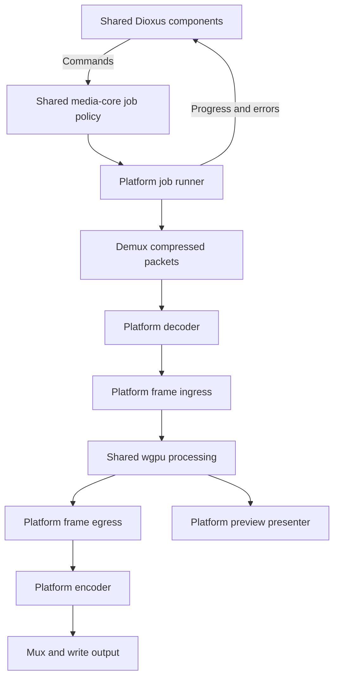

# GPU video converter: architecture and development plan

Status: design researched 2026-09-15; M3.1 through M3.6 pass their acceptance gates in the available Firefox/Chromium environments as of 2026-09-25. Configurable output, bounded streaming, named sizes, source metadata, capability-gated HEVC, controlled recovery, storage fallback/cleanup, explicit limit checks, and long-run stress are implemented. See [interop-report.md](interop-report.md) for milestone-specific evidence and limitations. Safari, non-Windows systems, other GPUs/drivers, spontaneous process/driver loss, and HEVC output on a supporting browser remain untested compatibility coverage rather than claims of support.

## 1. Architecture

### Core decisions

1. Use Dioxus for controls and job status. Launch with Dioxus Web; add Dioxus Native/Blitz later.
2. Share media types, job policy, transformation descriptions, wgpu pipelines, and WGSL between browser and native builds.
3. Put decoding, encoding, frame import/export, file access, and presentation behind platform boundaries.
4. Treat codecs and GPU processors as separate services. A GPU shader does not replace a video encoder.
5. Use one processing device and queue per execution context. Keep browser codecs and processing together in a dedicated worker when its capability probe succeeds, with an explicit main-thread compatibility fallback.
6. Target no application-managed CPU pixel round trips in the browser fast path. Track explicit copies and qualify claims about browser internals.
7. Build a linear pipeline first. Defer a general render graph, plugins, timeline editing, and multi-job scheduling.

### Data flow


```mermaid
flowchart TD
    UI[Shared Dioxus components] -->|Commands| Session[Shared media-core job policy]
    Session --> Host[Platform job runner]
    Host --> Demux[Demux compressed packets]
    Demux --> Decode[Platform decoder]
    Decode --> Import[Platform frame ingress]
    Import --> GPU[Shared wgpu processing]
    GPU --> Export[Platform frame egress]
    Export --> Encode[Platform encoder]
    Encode --> Mux[Mux and write output]
    GPU --> Preview[Platform preview presenter]
    Host -->|Progress and errors| UI
```

The diagram describes data flow, not crate dependency direction. `media-core` never imports a platform backend. The host composes platform services and drives shared policy.

WebCodecs operates on compressed chunks and frames; container parsing/writing is a separate concern. Its frame constructor accepts canvas image sources rather than an arbitrary wgpu texture, so canvas-based output is an interoperability experiment to validate. [WebCodecs specification](https://www.w3.org/TR/webcodecs/)

### Browser frame path

Firefox compatibility correction (2026-09-19): direct VideoFrame copying is attempted through the processing queue/texture's released wgpu `as_webgpu` handles in a catchable browser adapter. If source conversion throws TypeError, use createImageBitmap(VideoFrame), copy that image on the same device, retain it through GPU completion, and close it explicitly. This fallback was validated in Firefox 156 with M1 correctness and M3.2 WebM conversion/cancel/restart. Count the additional bitmap conversion per frame; no CPU pixel readback is added and internal copies remain unknown. Other copy errors propagate as job failures. This avoids a wgpu JavaScript exception becoming an unrecoverable Rust panic.

Baseline to prove first:

```text
compressed fixture packets
  → WebCodecs VideoDecoder
  → owned VideoFrame
  → wgpu Queue::copy_external_image_to_texture
  → ordinary RGBA wgpu texture
  → shared WGSL resize pass into a WebGPU canvas surface
  → new VideoFrame(canvas, timestamp/duration)
  → WebCodecs VideoEncoder
  → compressed output packets
```

The published wgpu WebAssembly API documents `ExternalImageSource::VideoFrame` and `Queue::copy_external_image_to_texture`. This is the baseline ingress candidate; successful compilation alone does not establish runtime support or copy behavior. [ExternalImageSource](https://docs.rs/wgpu/latest/wasm32-unknown-unknown/wgpu/enum.ExternalImageSource.html), [Queue API](https://docs.rs/wgpu/latest/wasm32-unknown-unknown/wgpu/struct.Queue.html#method.copy_external_image_to_texture)

Prefer a render pass for the first resize: it can write directly to the canvas attachment and works with the native version of the same shader. Keep the resize code independent of the surface. Later, use pooled offscreen outputs for multiple operations and add a final presentation/export pass. Do not require compute shaders for every operation.

For the copy baseline, validate an `Rgba8Unorm` input texture with `COPY_DST | TEXTURE_BINDING | RENDER_ATTACHMENT` usage against the selected API. Choose the output format from surface capabilities and build the render pipeline for that format; do not assume RGBA/BGRA interchangeability or storage-texture support on a canvas. M1 uses explicit sRGB boundary settings and opaque alpha, with bilinear resizing of sRGB-encoded channel values as a documented prototype limitation. Production linear-light filtering and wider color support belong to M3.

For the canvas handoff, acquire the current surface texture, render and submit, then follow the ordering validated for the pinned wgpu/browser integration without an unrelated await, animation callback, or canvas resize. With wgpu 30.0.1 and Edge 153, capturing before releasing/presenting the surface texture caused Chromium to report an uninitialized 160×90 shared image, while holding that texture through the completion wait eventually back-pressured the surface. M1 therefore uses `submit → present/release → VideoFrame(canvas) → submitted-work completion` with a persistent export canvas whose backing dimensions equal encoded dimensions. Both frame handles remain alive through completion. CSS size and UI layout must not change it. Test `HTMLCanvasElement` first; investigate `OffscreenCanvas` during worker migration only after M1.

Optimization candidate:

```text
VideoFrame → external-texture import → normalization/resize pass → output
```

Development wgpu documentation shows `Device::import_external_texture`, while the published 30.0.1 device page inspected for this plan did not list it. `create_external_texture` takes existing texture planes and is a different operation. Check the exact selected release, target features, and source before using direct import. Do not assume development documentation describes a released crate. [Development device source](https://wgpu.rs/doc/src/wgpu/api/device.rs.html), [Published Device API](https://docs.rs/wgpu/latest/wasm32-unknown-unknown/wgpu/struct.Device.html)

If direct import is unavailable, retain the baseline copy path. Do not create an independent JavaScript WebGPU device and assume its textures can be used by wgpu. Any future JavaScript bridge must use the same underlying device and documented interoperability APIs, stay inside the browser adapter, and preserve the shared processing code.

### What “minimize copies” means

| Boundary | Intended behavior | What must be measured |
|---|---|---|
| File → compressed packets | CPU bytes are expected | Streaming/buffering cost |
| Decoded VideoFrame → texture | Browser-managed image copy; direct import later | Conversion cost and hidden staging |
| GPU operation → next operation | GPU textures, pooled when needed | Pass count, bandwidth, allocation count |
| Processed canvas → encoder frame | Browser-managed snapshot/handoff | Hidden copy, synchronization, color conversion |
| Encoder → compressed bytes | CPU bytes are expected | Output buffering |
| GPU frame → diagnostic pixels | Test-only readback | Separately counted and excluded from throughput timings |

WebGPU allows an external texture to wrap a frame without a copy, but does not guarantee that implementation choice. External textures are sampleable snapshots, not writable storage textures. Closing their source `VideoFrame` expires them. Color conversion at WebGPU external-image boundaries also needs explicit attention. [WebGPU specification](https://www.w3.org/TR/webgpu/)

Call the proposed baseline “no explicit CPU pixel readback,” not “zero-copy.” Browser profiling may support narrower claims for a specific browser, GPU, and codec. It cannot turn an opaque handoff into a universal guarantee.

### Lifetime, scheduling, and correctness

- Wrap each browser frame with explicit `close()` and a Rust `Drop` safety net; do not rely on JavaScript garbage collection. Do not expose freely clonable frame owners.
- Give textures a device-generation identifier and pool lease. Never reuse a texture until its GPU work and downstream consumer have released it.
- Keep the decoded source frame and canvas snapshot alive through the submission-specific completion point. Present/release the acquired surface texture before snapshot construction; retaining the surface through the wait caused back-pressure in Edge 153. Do not weaken these lifetimes without repeating the full interop test.
- After `VideoEncoder.encode` accepts an output frame, close the application's frame handle; the encoder retains its own resource reference. Handle synchronous exceptions and asynchronous codec errors. [WebCodecs encoder and resource model](https://www.w3.org/TR/webcodecs/)
- Milestone 1 allows one processed frame in flight. Bound codec submissions and callback queues separately; do not accumulate an entire decoded clip.
- Later use a small credit-based pool, initially three frames. Reserve downstream capacity before feeding more decoder input. `decodeQueueSize` and `encodeQueueSize` alone do not account for every retained frame or pending GPU operation.
- Input pumping and output draining run concurrently. Never wait for one decoded output per submitted packet: codecs can buffer frames. At end of stream, flush the decoder while draining callbacks, finish GPU/export work, flush the encoder while draining output, then finalize the muxer.
- Preserve every frame for offline conversion; preview may sample/drop frames independently. Conversion must not be driven by display refresh rate.
- Carry integer timestamps with rational time bases, frame duration, coded/display sizes, visible rectangle, orientation, and color metadata. Distinguish presentation timestamps from decode timestamps. Convert to WebCodecs microseconds with checked arithmetic and an explicit rounding policy.
- Cancellation stops input, invalidates old callbacks with a job generation, closes queued resources, and discards incomplete output. GPU work already submitted may finish; cancellation must not destroy resources still in use.
- Handle device loss as a failed job with cleanup and an explicit restart path initially. Automatic checkpoint recovery comes later.

### Native rendering and codecs

Dioxus documents `desktop` as a webview renderer and `native` as its experimental Blitz-based renderer. Use the latter for the eventual native UI requirement. Blitz's repository describes ongoing beta development. [Dioxus renderer documentation](https://dioxuslabs.com/learn/0.7/beyond/project_structure/), [Blitz repository](https://github.com/DioxusLabs/blitz)

Do not couple processing to Blitz's internal renderer. Define a preview presenter adapter. First prove native conversion with a headless harness, then integrate a preview surface or a documented shared-device texture path with Blitz. UI and processing using wgpu does not imply that they use the same device or compatible crate versions.

Defer codec selection until the native phase. A software FFmpeg/library backend can establish correctness with explicitly counted uploads/readbacks. Hardware interop then requires a separate platform spike: Windows decoder surfaces may require D3D11/D3D12 sharing, macOS uses platform surface handles, and Linux uses external-memory handles. Adapter identity, fences, plane formats, and resource ownership belong in native ingress/egress, not in WGSL or `media-core`. These are candidate integration directions, not promised portable APIs.

## 2. Rust workspace layout

Create only the four M1 crates initially. Add later crates when the phase needs them.

```text
video-converter/
├── Cargo.toml                 # workspace, shared dependencies, resolver
├── Cargo.lock                 # committed application dependency resolution
├── rust-toolchain.toml        # pinned compatible toolchain + wasm target
├── AGENTS.md
├── README.md
├── apps/
│   ├── web/                   # M1: Dioxus Web launcher and tiny probe UI
│   └── native/                # later: Dioxus Native/Blitz launcher
├── crates/
│   ├── media-core/            # M1: pure Rust metadata and job rules
│   ├── media-gpu/             # M1: shared wgpu processor and WGSL
│   ├── media-web/             # M1: WebCodecs + browser frame bridge
│   ├── ui/                    # M2: extracted shared Dioxus components
│   ├── media-container/       # M2: container adapters
│   └── media-native/          # later: codec + native frame bridge
├── fixtures/                  # small reproducible, redistributable assets
│   └── README.md              # generation method, metadata, hashes/license
└── docs/
    ├── architecture.md
    ├── first-implementation-prompt.md
    ├── interop-report.md      # produced by M1, actual measured results
    └── adr/                   # significant decisions once tested
```

M1 package names: `converter-web`, `media-core`, `media-gpu`, `media-web`.

Use one selected wgpu version in workspace dependencies. Keep renderer and operating-system dependencies target-specific; avoid a universal `--all-features` build that accidentally selects incompatible renderers. Pin a released compatible Dioxus/wgpu/wasm-bindgen/web-sys set after a compile probe; no exact version combination is asserted by this design. Record any required binding flags rather than applying unstable settings globally without explanation.

## 3. Crate responsibilities and dependencies

| Crate | Owns | Dependencies / boundaries |
|---|---|---|
| `media-core` | Time bases, frame/packet metadata, operation specs, capability models, errors, job state and backend contracts | No Dioxus, wgpu, web-sys, codec FFI, DOM, filesystem, or executor dependency |
| `media-gpu` | Device context, texture leases, GPU frame representation, WGSL, pipelines, submission/completion tracking | `media-core`, wgpu; no browser codec or UI types |
| `media-web` | WebCodecs config/callbacks, owned VideoFrames, GPU ingress/egress, browser job runner and capability probes | `media-core`, `media-gpu`, wasm-bindgen/web-sys; narrowly scoped JS glue if necessary |
| `media-container` | Stream descriptions, demux/mux adapters, codec initialization data, packet ordering and container time conversion | `media-core`; wrap a proven library rather than write a general MP4 parser |
| `media-native` | Native codec runtime, CPU fallback, hardware-surface ownership and synchronization, native runner | `media-core`, `media-gpu`, optional platform codec dependencies |
| `ui` | Reusable Dioxus controls, settings forms, progress and error views | `media-core`, Dioxus; commands/events through injected service handles |
| `apps/web` | Dioxus Web startup, canvas mounting, browser source/sink selection, service wiring | Web adapter, later shared `ui` and container adapter |
| `apps/native` | Dioxus Native startup, native source/sink dialogs, preview integration, service wiring | Native adapter, shared `ui`, container adapter |

Keep browser-specific container-library glue inside `media-web` if the selected demux/mux library is JavaScript. Share the packet and track contracts without forcing all platform libraries into one crate. The native backend may use the container facilities of its codec library through the same contracts.

Move the probe UI into `ui` only when reusable controls exist. Avoid empty crates and speculative abstractions in M1.

## 4. Key traits and interfaces

The following are design sketches, not a compile-ready API or instructions to implement every trait in M1. Start with concrete browser adapters; extract interfaces as a second implementation or meaningful test requires them.

### Core data contracts

```rust
pub struct TimeBase {
    pub numerator: u32,
    pub denominator: u32, // validated nonzero
}

pub struct Timestamp {
    pub ticks: i64,
    pub time_base: TimeBase,
}

pub struct FrameMeta {
    pub pts: Timestamp,
    pub duration: Option<Timestamp>, // validated nonnegative
    pub coded_size: Size,
    pub visible_rect: Rect,
    pub display_size: Size,
    pub orientation: Orientation,
    pub color: ColorInfo,
}

pub struct Frame<T> {
    pub meta: FrameMeta,
    pub storage: T, // owned resource; no mandatory Clone or Send
}

pub struct EncodedPacket {
    pub track: TrackId,
    pub pts: Timestamp,
    pub dts: Option<Timestamp>,
    pub duration: Option<Timestamp>,
    pub keyframe: bool,
    pub data: Vec<u8>, // compressed bytes, not raw frame pixels
}
```

`Size`, `Rect`, `Orientation`, `ColorInfo`, and `TrackId` are validated domain types. Color metadata includes primaries, transfer function, matrix, range, and alpha interpretation; unknown values stay unknown until a documented policy resolves them. Put codec configuration/extradata in a separate stream event; packets must not silently discard configuration changes. WebCodecs output does not directly provide a general container DTS solution; M2 must choose a supported packet-order/timestamp policy and reject streams it cannot mux correctly.

### Asynchronous codecs

```rust
// Sketch using futures Sink/Stream; the traits themselves impose no Send bound.
pub trait DecoderBackend {
    type Storage;
    type Input: Sink<DecodeCommand, Error = MediaError>;
    type Output: Stream<Item = Result<DecodeEvent<Self::Storage>, MediaError>>;

    fn open(&self, config: DecodeConfig)
        -> Result<(Self::Input, Self::Output), MediaError>;
}

pub trait EncoderBackend {
    type Storage;
    type Input: Sink<EncodeCommand<Self::Storage>, Error = MediaError>;
    type Output: Stream<Item = Result<EncodeEvent, MediaError>>;

    fn open(&self, config: EncodeConfig)
        -> Result<(Self::Input, Self::Output), MediaError>;
}
```

`DecodeCommand` contains packet, end-of-stream, and abort commands. `DecodeEvent` contains frame, configuration-change, and drained events. `EncodeCommand` contains frame/options, end-of-stream, and abort commands; `EncodeEvent` contains configuration, packet, and drained events. Input readiness reflects bounded capacity. An accepted command transfers ownership; errors/drop paths release it. Both halves run concurrently. A drained event means all output callbacks for the end-of-stream operation have been delivered, not merely that a queue counter reached zero. Define `Sink::flush` as command transport flushing; explicit end-of-stream controls codec draining.

Split input/output avoids the deadlock-prone `decode(packet).await -> one frame` model. Native ports may add `Send` when moved between native threads; browser ports stay local. No `unsafe impl Send` for browser handles and no mandatory Tokio runtime in shared code.

### GPU bridge and processor

```rust
// media-gpu: these contain no web_sys or native codec types.
pub struct GpuFrame {
    pub meta: FrameMeta,
    pub storage: TextureLease,
    pub device_generation: DeviceGeneration,
}

pub struct ImportedFrame<G> {
    pub gpu: GpuFrame,
    pub keep_alive: G, // preserves decoder/import resource lifetime
}

// Implemented by platform adapters. Local futures are deliberate.
pub trait FrameBridge {
    type Decoded;
    type Encodable;
    type ImportGuard;

    fn import(&mut self, input: Frame<Self::Decoded>, gpu: &GpuContext)
        -> Result<ImportedFrame<Self::ImportGuard>, MediaError>;

    async fn export(&mut self, input: GpuFrame, gpu: &GpuContext)
        -> Result<Frame<Self::Encodable>, MediaError>;
}

// Prefer a concrete shared processor until there are multiple processors.
impl GpuProcessor {
    pub fn record_resize(
        &self,
        commands: &mut wgpu::CommandEncoder,
        source: &wgpu::TextureView,
        target: &wgpu::TextureView,
        operation: &ResizeSpec,
    ) -> Result<(), MediaError>;
}
```

`TextureLease`, `GpuContext`, and `DeviceGeneration` encapsulate allocation, device identity, and completion tracking. The job runner retains `ImportedFrame` guards until the submission is safe to release and retires output leases only after export has consumed them. `export` must retain its input across any asynchronous work and perform canvas render/submit/capture as an uninterrupted sequence internally. It cannot treat arbitrary textures as encoder frames.

For M1, call `record_resize` directly with the canvas target to avoid an unnecessary intermediate. The general `export(GpuFrame)` path is for later pooled processing outputs. A future external-texture ingress may normalize to a regular texture or use a dedicated sampling entry point; shared transform math should remain common.

Other contracts, added when needed:

- `Demuxer`: stream configuration plus ordered `EncodedPacket` events, with seeking optional.
- `Muxer`: consume configuration/packet events and finish through an injected byte sink.
- `ByteSource` / `ByteSink`: bounded reads/writes; filesystem and browser handles remain outside core.
- `PreviewPresenter`: consume a GPU output through a platform adapter without forcing CPU images into Dioxus state.
- `JobCommand` / `JobEvent`: start, cancel, progress, failed, completed; updates are throttled and contain metadata rather than frames.
- `BackendCapabilities`: exact codec/config support, GPU limits, supported bridge paths, copy classification, and acceleration preference with actual hardware use marked unknown when unobservable.

## 5. Phased implementation roadmap

### M1 — browser round-trip experiment

**Question:** Can the selected Rust/browser stack decode a frame, resize it with shared wgpu code, and encode the result without application-managed CPU pixel readback?

**Scope:** one tested Chromium-based browser, one fixed video codec (try VP8), opaque SDR, 320×180 input, 160×90 output, 30 numbered frames, no audio, no general file picker, no container muxing, no native application.

Use a checked-in tiny compressed fixture with a packet manifest containing timestamps, durations, keyframe flags, and codec configuration. Include colored areas, orientation markers, and changing frame identifiers. A raw compressed-packet fixture avoids a demuxer dependency. Fixture generation happens separately and is documented; it must not replace testing actual `VideoDecoder` output.

Implementation order:

1. Pin a compatible released toolchain/dependency set. Build the four small crates for their intended targets.
2. Create a Dioxus Web page with Run, Cancel, a canvas, and concise status. Probe secure context, WebGPU, exact decoder/encoder configs, canvas capture, and selected ingress API. Report unsupported configurations explicitly.
3. Decode one fixture frame, copy it into a wgpu texture, resize with shared WGSL, and render to the canvas.
4. Capture the rendered canvas as a timestamped VideoFrame; encode it and collect compressed output. This is the critical gate, not just displaying decoded video.
5. Process all 30 frames with one processing slot, bounded input/callback queues, explicit ownership, end-of-stream draining, and cancellation cleanup.
6. Decode the encoded result again using the returned codec configuration. Check dimensions, frame count, timestamps, markers, and representative colors. Test-only readback is allowed in this verification step and measured separately.
7. Produce `docs/interop-report.md` with tested environment, pinned versions/features, API path, synchronization sequence, queue/live-frame high-water marks, observed timings, and unresolved limitations.

**Acceptance gates:**

- A real browser run successfully decodes → resizes → encodes → re-decodes all 30 frames; no black/stale/repeated output. Counts refer to decoded frames, not an assumption that packets always map one-to-one.
- Encoded output is 160×90; expected timestamps/durations are preserved within the declared conversion precision. Use codec-tolerant pixel thresholds and marker checks, not byte-identical video comparisons.
- The conversion path does not call `VideoFrame.copyTo`, `getImageData`, GPU readback mapping, or readback followed by `write_texture` for frame pixels. Uniform uploads and compressed packet copies are fine.
- Explicit copy counters, retained-frame counts, and peak queue lengths are reported. Do not claim knowledge of hidden browser copies.
- Five repeated runs and cancellation/restart return application-owned live frames to zero after cleanup, without validation errors or unbounded queue growth. Long-run memory profiling is M3.
- Failure to obtain WebGPU or a supported codec reports a clear reason. GPU or codec failure does not leave a permanently running job.
- A host check of `media-core` and `media-gpu` proves basic portability; an actual browser run proves interop. Neither substitutes for the other.

Do not impose a real-time throughput target on this correctness spike. Record a baseline. Try direct external-texture import only as a small optional comparison after the baseline works with a documented released API. If canvas export fails or requires explicit CPU readback, document the result and stop expansion until the architecture decision is revisited; displaying a preview is not a passing substitute.

### M2 — smallest usable browser converter

Implementation status (2026-09-18): the measured M2 path is MP4/H.264 input to video-only WebM/VP8 output using Mediabunny 1.58.0 for demux/mux and WebCodecs orchestration. The sole resize preset is half width and height with even codec dimensions. Input is capped at 256 MiB and output uses an in-memory buffer; audio is detected, prominently reported, and omitted. Rotation/flip metadata is rejected rather than silently lost. Streaming, audio processing, and broader format support remain M3 or later work.

- One input/output container and codec combination, selected from measured support; video-only with a clear audio warning.
- Integrate a proven demux/mux implementation. Handle codec initialization metadata, keyframes, timestamp rescaling, and output finalization.
- File selection, one resize setting, progress, cancellation, and a downloadable playable output.
- Keep small-file size/memory limits explicit until streaming output exists.
- Extract reusable Dioxus components into `ui`; keep canvas mounting platform-specific.
- Validate exported files with an independent player/inspector, including duration and seeking. No dropped video frames.

### M3 — throughput, color, and browser robustness

M3 is split into ordered, independently releasable sub-milestones. Do not begin a later sub-milestone until the preceding acceptance gate is recorded in `docs/interop-report.md`. Each profile binds its container, video codec, audio codec/policy, extension, and muxer settings; the UI must never offer an invalid combination or silently substitute another profile.

#### M3.1 — output-profile model and audio-preserving WebM

Implementation status (2026-09-18): the preferred `WebmVp8Opus` profile and the explicit `WebmVp8VideoOnly` profile are implemented. `media-core` owns the profile/audio policy and exact-reason capability result; `media-web` owns the exercised local `BrowserConversionBackend` contract and its `WebCodecsMediabunnyBackend`; JavaScript at that boundary contains the concrete Mediabunny input/output adapters and the browser job orchestrator. Audio and video pumps run concurrently with awaited per-track backpressure, one shared integer-microsecond origin, ordered end-of-stream finalization, and sibling failure/cancellation cleanup. The more granular `DecoderBackend`/`EncoderBackend`/`FrameBridge` examples above remain design sketches until an actual alternative backend requires those seams; promoting them now would create unexercised interfaces, contrary to the repository rule. M3.2 subsequently reused these contracts without duplicating job policy.

- Add platform-neutral output-profile and audio-policy types to `media-core`, plus capability results that carry an exact unsupported reason.
- Turn the existing `DecoderBackend`, `EncoderBackend`, packet/track, and `FrameBridge` sketches into the smallest real contracts needed by a second codec implementation. Keep command/event draining, ownership, cancellation, timestamps, and capability reporting independent of WebCodecs, FFmpeg, containers, Dioxus, and wgpu. Browser futures may remain non-`Send`; do not introduce Tokio, threads, or unsafe `Send`/`Sync` implementations.
- Split the current hard-coded M2 runner into a browser job orchestrator plus concrete `WebCodecs` codec and Mediabunny container adapters. Preserve the proven M2 behavior before adding another backend; avoid an abstract factory hierarchy or interfaces without an exercised implementation.
- Replace the fixed output label with a reusable profile selector. Retain an explicit video-only WebM/VP8 profile and add WebM/VP8/Opus as the preferred audio-preserving profile when the exact browser configuration is supported.
- For MP4/AAC input, decode audio and encode Opus while video uses the existing wgpu path. Passthrough is allowed only when the source codec/configuration is already compatible with the chosen container.
- Bound audio decode/encode callbacks independently, preserve integer timestamps and durations, define start-offset/end-of-stream policy, and clean up both tracks on cancellation or failure.

**Acceptance gate:** the deterministic H.264/AAC fixture exports a WebM containing all 60 VP8 frames and an Opus track; independent inspection/player tests verify duration, seeking, audible output, and A/V synchronization near the beginning, midpoint, and end. The WebCodecs/Mediabunny implementation runs through the new backend/orchestrator contracts; video-only selection, cancellation/restart, and the M1 probe still pass without duplicated job policy.

#### M3.2 — real output-container choice

Implementation status (2026-09-18): `Mp4H264Aac` is implemented as a complete profile alongside both WebM profiles. File selection probes the exact half-size H.264 frame geometry/rate and 48 kHz AAC channel configuration; the selector enables MP4 only when both probes pass and otherwise displays the exact failed reason. The concrete output adapter selects either WebM or fast-start MP4 while the shared job orchestration, audio/video pumps, timing origin, cancellation, GPU processor, and verification policy remain common. The deterministic fixture and an additional 147-second stereo input passed browser and FFmpeg inspection. M3.3 has not started.

- Probe an MP4/H.264/AAC encode profile using exact `VideoEncoder` and `AudioEncoder` configurations plus the selected muxer. Show it disabled with the failed capability when any required part is unavailable.
- Enable MP4 only after the tested browser produces a finalized, seekable file with correct codec initialization records, keyframes, frame/sample counts, duration, and A/V synchronization.
- Keep WebM and MP4 settings isolated behind concrete profiles; do not create an arbitrary container/codec mix-and-match UI.

**Acceptance gate:** the selector offers both WebM and MP4 on a browser that passes both capability probes, or visibly explains why MP4 is unavailable. Every enabled profile passes independent player/inspector validation with no dropped video frames or audio samples outside the declared encoder-padding tolerance.

HEVC extension (2026-09-24): `Mp4H265Aac` is a fourth concrete profile using Mediabunny's HEVC MP4 path and the existing AAC, scheduling, GPU, muxing, cancellation, and verification machinery. The MP4 input adapter accepts both AVC and HEVC after exact decoder probing. H.265 output is shown only when the exact HEVC/AAC encoder configuration passes; it is never substituted for H.264. The deterministic `m36-h265-aac.mp4` fixture proves HEVC input through the full Chromium decode → wgpu resize → VP8 encode → re-decode path. The tested Chromium environment rejected HEVC encoding and Firefox rejected HEVC decoding/encoding, so output execution remains unverified while its unavailable-state behavior is verified.

#### M3.3 — worker migration

Implementation status (2026-09-19, superseding the earlier M3.2 status): acceptance passed in Firefox 156 for both enabled WebM profiles and in Edge/Chromium 153 for all three profiles, including MP4/H.264/AAC. Worker and explicit main-thread paths passed conversion, cancellation/restart, lifecycle counters, playback and five repeated M1 correctness checks per path. A real Chromium test also injected worker-constructor failure and verified visible automatic fallback with all three profiles. Independent FFmpeg inspection passed frame/audio counts, audio seeks and MP4 fast-start layout; the pre-existing Opus header warning remains documented. The user supplied an isolated Chromium debugging session to resolve the earlier launch restriction. Firefox still disables MP4 because its exact AAC encoder probe fails. M3.4 results are recorded in the following section.

The `media-web` module worker imports the same Dioxus-produced wasm bundle; app startup mounts Dioxus only when `document` exists. No second Rust build or duplicate processor is maintained. wasm-bindgen copies `worker-host.js` as a local module snippet; it resolves the pinned Dioxus `wasm/converter-web.js` layout relative to the inline binding. The hashed codec-script URLs are supplied by `asset!`, not guessed by the worker. Renaming the app or changing the bundler layout requires updating/testing that resolver. The worker pays for a second wasm instance including currently unused UI code; bundle splitting is not part of this correctness milestone.

One platform-owned preview canvas is transferred once during startup. Rust creates the real device/surface on this OffscreenCanvas, probes VideoFrame capture, then reuses the same session for capability probes, conversion, and M1. The HTML canvas is retained separately for fallback. Both variants use the same resize pipeline, ingress, render/present/capture order and GPU-completion guards; raw frames never cross to the window or enter Dioxus signals. A completed compressed Blob crosses back to the window, which owns/revokes its download URL.

Startup checks secure context, worker codec APIs, WebGPU, OffscreenCanvas, device/surface creation, and capture, with a 30-second startup timeout. Exact profile probes run in the selected execution context. Failure before startup selects the main-thread path with its reason displayed; `?execution=main` explicitly selects that path for comparison. Runtime job errors do not silently rerun on the main thread. Transport errors terminate the failed context, reject pending work, and permit a fresh worker on the next request. Commands are serialized and tagged; cancellation invalidates queued jobs and drains the active codec job. Late progress is ignored. Cancellation during startup prevents a job from starting once the bounded startup probe finishes. There is no general hung-codec/device watchdog yet.

Startup diagnostics follow-up (2026-10-08): worker bootstrap now sends fixed phase metadata for capability checks, module imports/wasm initialization, the actual adapter/device requests, shared pipeline creation and surface capture. Window transport retains at most 12 cumulative timing entries, separate from conversion progress; conversion/M1 reports include them, while compact preview status omits the full trace. The unchanged 30-second deadline names the last phase, terminates the failed worker and retains visible pre-start compatibility fallback. GPU identity is read synchronously from the actual processing device's `adapterInfo`, with the selected wgpu adapter label as fallback; do not make a second `navigator.gpu.requestAdapter` merely for a UI label or await optional identity metadata. Six fresh Chromium starts passed in 240–312 ms. This removes an unnecessary async dependency and makes future stalls diagnosable; the earlier intermittent timeout's cause remains unconfirmed, not declared solved.

Application-held frame-reference/sample counts cover the conversion pumps and return to zero on completion and cancellation. Closed references retained until their `finally` block are conservatively counted; these are not internal codec queue or GPU-memory measurements. M1 retains its separate live-frame/callback instrumentation. Fine-grained bounds, pool telemetry and throughput work remain M3.4.

- Move demux/codec orchestration and wgpu processing into one dedicated worker so frame handles remain in that execution context.
- Probe worker WebGPU, WebCodecs, and `OffscreenCanvas` before enabling the worker path. Retain the measured main-thread implementation as an explicit compatibility fallback.
- Use structured job commands and metadata/progress events only; do not send raw frames or GPU handles through Dioxus state.

**Acceptance gate:** both worker and fallback paths pass every enabled output profile, cancellation/restart, lifecycle counters, and M1 correctness checks. The UI remains responsive during conversion, and fallback reasons are visible.

#### M3.4 — bounded throughput and resource reuse

Implementation status (2026-09-20): acceptance passed for the tested environments. Every stage now reports live/peak/total/discarded counts, while the underlying Mediabunny decoder, WebCodecs encoder, and mux policies retain their separate bounds. The GPU path uses a device-generation-tagged four-slot input-texture ring per configured size and reports allocations, reuse, copies, captures, CPU bridge/submission time, overlapping completion latency, slot-reuse wait, and final-drain wait. Each slot retains its decoded frame and optional compatibility bitmap until that slot's completion callback; reuse retires the previous submission first, and completion/cancellation drains the ring. This removed the earlier per-frame completion barrier while keeping at most four GPU lifetimes. Firefox's deterministic 60-frame conversions improved from roughly 6.2 seconds to 1.2–1.8 seconds without changing codecs, confirming that the old serialization was the dominant short-job cost. After the first real copy establishes that bitmap compatibility ingress is required, subsequent bitmaps are prepared in bounded groups of four and consumed in timestamp order; cancellation closes every prepared or pending bitmap. Firefox exposed only two concurrent bitmap tasks and still spent roughly 0.9–1.0 seconds of cumulative task latency, so this produced only a modest additional wall-time improvement and did not eliminate the remaining browser bridge cost. Production timing now stops after encode/mux finalization; full output re-decode/seek/audio verification is an explicit `?verify=full` diagnostic whose time is reported separately and remains enabled in interoperability tests. A UI selector carries an exact `no-preference` or `prefer-hardware` request through worker and fallback paths; exact decoder and encoder probes choose the requested setting only when the complete profile passes, otherwise the baseline fallback and reason are visible. On the tested browsers, `prefer-hardware` encoding was unsupported for every enabled profile, so no automatic hardware preference or hardware-codec benefit is claimed. The selected wgpu backend exposes no released direct VideoFrame import, and reliable codec-attributed CPU/power data was not observable; both remain explicitly unmeasured rather than inferred. M3.5 was subsequently completed as recorded below.

- Add separately bounded decoder submissions, decoded callbacks, GPU processing, audio queues, encoder submissions, and mux writes.
- Add device-generation-aware texture pools, allocation/live-resource telemetry, copy counters, and long-running tests. Separate CPU submission latency from GPU execution time; use GPU timestamp queries only when supported.
- Compare WebCodecs `hardwareAcceleration: "no-preference"` with `"prefer-hardware"` for every enabled output profile using exact decoder and encoder capability probes. Keep `"no-preference"` as the compatibility baseline; use `"prefer-hardware"` only when the complete profile remains supported and measured results justify it. Fall back visibly rather than failing the job or silently changing codecs.
- Measure end-to-end throughput, startup latency, CPU load, power where observable, output correctness, and stability. Treat the preference as a browser hint: neither successful configuration nor the displayed wgpu adapter proves which codec implementation or GPU WebCodecs used.
- Compare the baseline external-image copy with direct external import only if a released API supports it. Measure both ingress and egress before claiming a gain.

**Acceptance gate:** repeated short jobs and at least one long input show stable queue/resource high-water marks, zero application-owned live frames after cleanup, no premature texture reuse, and no regression in output correctness. The interoperability report records both hardware-preference configurations for each enabled profile, including unsupported results and measured tradeoffs; any automatic preference decision has a tested `"no-preference"` fallback. Report throughput as measurements, not a real-time or hardware-execution guarantee.

#### M3.5 — geometry, timing, and color correctness

Implementation status (2026-09-21): acceptance passed for the tested Firefox/Chromium environments. `media-core` now represents coded/visible/square-pixel geometry and the ordered rotation/flip transform. At the browser boundary, decoded `VideoFrame` external-image import normalizes the visible crop, pixel aspect ratio, and supported SDR color conversion into a square-pixel sRGB processing texture; the shared WGSL processor then applies clockwise rotation followed by horizontal flip while resizing. Output is always square-pixel, unrotated, and unflipped because geometry is baked into pixels. The accepted input policy is opaque BT.709/sRGB SDR; BT.2020/PQ or other HDR/wide-color combinations fail before conversion. Mid-stream coded size, visible rectangle, square-pixel size, orientation, or color changes fail the active job and drain owned resources rather than silently reconfigure. Integer timestamps and durations are preserved through WebCodecs and verified packet-by-packet after muxing, allowing only the selected container's timebase quantization; the final packet may derive its omitted duration from separately verified track coverage. The deterministic geometry/color and VFR/non-zero-origin fixtures passed every profile enabled in Edge 153 and Firefox 156, including decoded marker colors, midpoint seek, audio checks, and A/V offsets. The tested H.264 decoders normalized SPS clean-aperture cropping into a full decoded `visibleRect`; non-zero decoder-exposed crop offsets remain implemented but were not produced by these browser/codec combinations.

- Define the SDR color pipeline and metadata policy, then implement crop, pixel-aspect ratio, rotation, and flip instead of rejecting them.
- Add variable-frame-rate, non-zero-start, orientation, and color fixtures. Define and test the mid-stream resolution-change policy.
- Continue rejecting HDR until transfer functions, gamut mapping, metadata, and output profiles are implemented and independently verified.

**Acceptance gate:** metadata-rich fixtures pass orientation/crop, per-frame timestamp, duration, seek, representative color, and A/V synchronization checks in every enabled profile. Unsupported HDR and resolution changes fail clearly rather than producing altered output.

#### M3.6 — configurable output, streaming, compatibility matrix, and recovery

Implementation status (updated 2026-09-25): the configurable-output and bounded-streaming slices passed their tested Firefox/Chromium matrix. `media-core::ResizeSpec` now provides original, validated percentage, named HD 720p, Full HD 1080p, 2K-width, QHD 1440p, 4K UHD, and exact-bound output policy. Named modes are aspect-preserving maximum bounds, not crop/stretch promises; they retain the no-upscale rule and show the actual codec-safe result. Exact output preserves display aspect ratio by default; the explicit unlocked mode stretches to the requested dimensions. Resolution happens after crop, pixel-aspect normalization, and orientation, disallows implicit upscaling, and floors codec dimensions to visible even values. The UI shows the selected input's display/coded resolution, H.264/H.265 codec string, duration, average frame rate, frame count, audio codec/channels/rate, and file size. It re-probes every output profile at the exact resolved size before conversion. Full browser encode/re-decode checks passed original, 75%, 50%, 25%, exact 500×500 locked, and exact odd 501×301 unlocked output in every enabled profile; cancellation after a size change and invalid-upscale rejection returned owned resources to zero. Input uses an 8 MiB bounded BlobSource cache. Compressed output uses a backpressure-aware Mediabunny `StreamTarget` with 4 MiB chunks over origin-private file storage, then exposes the disk-backed `File` through the existing download URL; the current file remains while that URL is usable and is removed on replacement or page exit. Both browsers converted a valid logical 257.3 MiB sparse MP4 that previously crossed the fixed limit. If origin-private streaming is unavailable, the status names the memory fallback and its retained 256 MiB input cap; forced mode, automatic API-unavailable fallback, and oversized-input rejection passed Chromium compatibility tests.

The recovery slice now has deterministic, test-only codec and WebGPU device-loss injection. Codec failure is injected after five GPU-processed frames; the device-loss case destroys the active wgpu device after four completed frames. Both failures stop the job, drain submitted GPU work, close/discard owned frame, bitmap, sample, codec, muxer, and partial-output resources, and leave the page ready for an explicit retry. A lost session is invalidated while its retained canvas permits a new session and device generation in both worker/OffscreenCanvas and main-thread contexts. Same-page retries passed full output re-decode in Firefox and Chromium: codec retries retained generation 1, while device-loss retries recreated generation 2. This validates the controlled application recovery boundary, not spontaneous driver reset, process loss, an indefinitely hung codec callback, or automatic checkpoint/resume.

Final M3.6 acceptance (2026-09-25): the real-browser resize matrix includes the 50% mode, producing 18 Chromium and 12 Firefox profile/size conversions with full re-decode. A page-exit cleanup command removes the current execution context's retained OPFS entry without deleting entries potentially owned by another tab; synthetic pagehide and real same-origin navigation returned both browsers to their recorded pre-test baselines. Chromium also passed the normal automatic memory-fallback branch with `getDirectory` unavailable in the tested main-thread context, without the `?output=memory` switch. The selected Chromium adapter reported a 16,384-pixel 2D texture limit; the app checks input/output dimensions against the actual wgpu device limit before resource creation, and direct exact VP8 probes accepted 8,192² but rejected 16,384² and above. A 70,439,352-byte, 147.3-second local input produced 3,530 frames and a 32,138,436-byte output through 17 bounded writes (maximum exactly 4 MiB), passed complete timeline/audio re-decode, ended all application ownership counters at zero, and kept the worker-hosted page responsive. This closes the M3.6 acceptance gate for available environments; the compatibility limitations above remain explicit.

Profile-selector correction (2026-09-25): output availability is defined by the selected input decoder, audio track, frame rate, and resolved dimensions. The profile selector and Convert action therefore remain disabled until that exact file probe succeeds. A new file or size choice invalidates the previous result while probing. Initial WebM options are no longer presented as selectable while MP4 options await input-specific checks. Chromium and Firefox browser harnesses verified the disabled initial state and the expected post-input H.264 MP4 availability in each browser.

Initial resize selection (2026-09-25): the UI now starts at Original size. The 50% mode remains available and is chosen explicitly by historical half-size regression harnesses; the resize matrix verifies Original as the initial selection and fully re-decodes every enabled profile at that size.

- Replace the fixed `ResizePreset::Half` UI policy with a platform-neutral `ResizeSpec` owned by `media-core`. Initially expose original size, percentage presets (75%, 50%, 25%), and exact width/height. Preserve display aspect ratio by default, offer an explicit aspect-ratio lock, and never silently stretch, crop, or upscale.
- Resolve resize dimensions only after visible crop, pixel-aspect-ratio normalization, and rotation. Define deterministic fit behavior when both exact dimensions are supplied, round codec-constrained dimensions to valid even values with the adjusted result visible before conversion, and reject zero, overflowed, GPU-limit, or encoder-limit sizes clearly.
- Carry the resolved size through profile capability probing, GPU configuration/resource reuse, canvas/export, filename/status metadata, and full output verification. Re-probe every enabled output profile for the exact chosen dimensions instead of assuming a preset-supported encoder configuration.
- Add focused `media-core` tests for aspect preservation, fit boxes, odd-dimension adjustment, rotated/non-square-pixel input, no-upscale policy, and overflow. Add real-browser coverage for original, percentage, and exact-size output across the enabled profile matrix, including cancellation/restart after changing size.
- Replace the in-memory output target and 256 MiB input policy with bounded streaming where browser file APIs permit it; retain a clearly labeled memory fallback.
- Expand the measured browser/input/output matrix one profile at a time. Additional WebM codecs such as VP9 or AV1 are added only as complete, capability-probed profiles.
- Handle device loss and codec failure by stopping input, draining/closing owned resources, invalidating the device generation, and allowing a clean restart or documented fallback.

**Acceptance gate:** every enabled profile produces verified original-size, percentage, and exact-size outputs with the displayed resolved dimensions, preserved aspect ratio, correct orientation, and valid codec geometry; invalid requests fail before conversion. An input larger than the former limit completes without retaining the entire input or output in application memory; the compatibility report lists exact tested browser/profile combinations; injected failure and available device-loss tests return owned resources to zero and permit restart.

#### M3.7 — conditional FFmpeg WASM backend spike

Historical M3.7 status (superseded by M3.8's raw-frame ring below): an explicitly selected `?backend=ffmpeg-wasm` MP4/H.264/AAC compatibility spike shares the M3 browser job, WebCodecs decode, metadata checks, and wgpu processing with the default WebCodecs path. A browser-local `OutputStorageKind` policy gives both codec output adapters the same OPFS output contract; WebCodecs retains its bounded `StreamTarget` and memory compatibility fallback, whereas FFmpeg requires OPFS. M3.7 received one wgpu-produced `VideoFrame.copyTo` RGBA readback at a time, spooled it to OPFS, read the original `File` through Emscripten WORKERFS, and read/wrote the raw spool and final MP4 through worker-side synchronous OPFS file devices. Its prior 64 MiB whole-source and 128 MiB in-memory raw caps were replaced by a 2 GiB raw-disk-spool policy with a browser quota preflight; source size was no longer capped by this adapter. It accepted integer constant rates 1–120 fps plus 24000/1001, 30000/1001, and 60000/1001, and still required exactly one audio track and exact per-frame timing. The UI marks WebM/HEVC choices unavailable in FFmpeg mode, and WebCodecs remains the default. Both available browsers passed the 60-frame fixture and a valid 257.3 MiB sparse MP4 source through FFmpeg, with full re-decode, independent ffprobe, cancellation, and same-page retry. This was a disk-backed compatibility route, not a no-readback fast path or proof of bounded FFmpeg internal/WASM memory. Core assets are large and GPL-licensed; full browser-process peak resident memory, broad geometry/VFR cases, distribution compliance, and production resource suitability remain unresolved. See `docs/interop-report.md` for measured results.

Unavailable FFmpeg profiles keep selected input metadata and show the exact rejected reason beside the disabled selector, including a route back to WebCodecs. In M3.7, the 2 GiB raw-RGBA spool bound was an application disk policy, not a source-size cap or a guarantee that all accepted clips fit in FFmpeg's WASM address space. The source and output were streamed at the filesystem boundary, but raw frames were spooled before encoding rather than encoded concurrently with GPU processing. M3.8 removes that raw spool; a much larger clip may still exhaust compressed-output OPFS quota or FFmpeg internal memory, neither of which is silently retried in memory.

- Add FFmpeg WASM only when a measured browser compatibility gap or requested codec/profile justifies its download size, startup cost, memory use, and maintenance burden. Implement it as an alternative browser codec/container backend, preferably in a worker, behind the M3.1 contracts; do not put it in `media-native` or duplicate shared job policy.
- Keep the shared wgpu processor only when the FFmpeg WASM frame bridge can be implemented correctly. Count and report every explicit WASM-memory copy, CPU pixel upload, and GPU readback; a software encoder path that requires GPU readback is a compatibility fallback and must not inherit the WebCodecs path's no-explicit-readback claim.
- Select backends from exact profile capabilities and an explicit user/developer preference. Never silently switch codecs, containers, quality settings, or processing implementations when falling back.

**Acceptance gate:** at least one justified output profile completes through both WebCodecs and FFmpeg WASM using the same job/profile policy; independent output checks pass; cancellation returns owned frames and WASM resources to zero; startup, throughput, peak memory, bundle/download size, and copy counts are recorded side by side. If the spike is not justified or fails its resource/correctness gate, document the result and retain WebCodecs without blocking M4.

#### M3.8 — bounded FFmpeg frame stream

Implementation status (2026-09-25): the FFmpeg WASM adapter now uses the four-slot, 4 MiB `SharedArrayBuffer` ring below. The generated FFmpeg worker mounts it as a non-seekable synchronous Emscripten input device, starts `exec` before frame production finishes, and streams the final compressed MP4 to OPFS. No raw-frame OPFS file or 2 GiB raw-spool policy remains. The source still uses WORKERFS; WebCodecs and shared wgpu processing are unchanged. FFmpeg mode requires a cross-origin-isolated page and non-blocking `Atomics.waitAsync`; `dx serve --web --cross-origin-policy` supplies COOP/COEP for development, and production hosting must supply equivalent headers. Both available Firefox and Chromium environments passed full re-decode on a synthetic 2.21 GB logical-RGBA / 2,400-frame case, including H.264/AAC and independent FFprobe; details and outstanding limits are in `docs/interop-report.md`. The FFmpeg path still performs one explicit RGBA GPU readback and a copy to the WASM heap per frame, and its internal memory is not bounded by the ring.

**Goal and scope.** Remove the M3.7 *raw intermediate frame* OPFS spool and its 2 GiB policy limit. Do not change the default WebCodecs backend, the shared wgpu processor, codec/profile selection, or the compressed-input/output storage policy. The selected source `File` may still be read through WORKERFS and the final compressed MP4 may still stream to OPFS; “no raw disk persistence” does not mean keeping a whole output movie in memory. FFmpeg WASM still requires one explicit `VideoFrame.copyTo` GPU→CPU RGBA readback per processed frame, followed by a copy into its WASM heap. This milestone cannot claim a no-readback or zero-copy FFmpeg path. It is an optional follow-up to M3.7, not a prerequisite for M4.

**Backend boundary.** Keep one browser job/profile/timestamp policy and one wgpu processor. The concrete WebCodecs output adapter continues to accept processed `VideoFrame`s and stream encoded packets through Mediabunny. The concrete FFmpeg output adapter accepts the same processed frames but publishes RGBA bytes through a bounded `EncoderIngress` transport. A browser-local enum can describe the actually exercised ingress (`DirectVideoFrame` for WebCodecs, `SharedRgbaRing` for FFmpeg); the existing `OutputStorageKind` continues to describe *compressed-output* storage independently. Do not move `SharedArrayBuffer`, DOM, FFmpeg FS, or OPFS types into `media-core`, and do not add a generic Rust trait merely for this transport. The FFmpeg adapter owns the ring and the small worker-side FS device shim. The Dioxus UI only displays capability, progress, and errors.

```text
WebCodecs: decoded frame → shared wgpu processor → VideoFrame → WebCodecs encoder → compressed output stream
FFmpeg:   decoded frame → shared wgpu processor → VideoFrame.copyTo(one reusable RGBA frame buffer)
         → bounded shared-memory byte ring → FFmpeg worker synchronous FS read → libx264/AAC → compressed OPFS output
```

**Why a shared ring.** The pinned FFmpeg WASM worker calls FFmpeg's synchronous `exec`, and its Emscripten FS device `read` callback is synchronous. A normal `postMessage` queue or async `ReadableStream` cannot supply the next bytes while that worker is blocked inside `exec`: its message handler cannot run until the call returns. A `SharedArrayBuffer` ring lets the *consumer* block with `Atomics.wait` inside the dedicated FFmpeg worker while the producer, in the browser processing worker or main-thread compatibility path, continues asynchronously. The producer must never call blocking `Atomics.wait` on the page thread; wait for released slots using `Atomics.waitAsync` only after a capability check, or worker-to-producer release notifications plus an atomic recheck to avoid missed wakeups. This is a dedicated-worker-only blocking consumer, not a promise that FFmpeg's public API natively accepts browser streams. [Emscripten device callbacks](https://emscripten.org/docs/api_reference/Filesystem-API.html#devices), [Atomics.wait restrictions](https://developer.mozilla.org/en-US/docs/Web/JavaScript/Reference/Global_Objects/Atomics/wait).

**Protocol and boundedness.** Use a fixed byte budget (four 1 MiB slots), with per-slot atomic `FREE`/`READY` state and published byte length, plus atomic `RUNNING`/`EOF`/`ABORT` control; the surrounding browser job owns stale-callback/generation handling. Copy only into a free slot; publish length and then `READY` atomically. The FS `read` callback consumes bytes in strict slot order, supports arbitrary request sizes across slot/frame boundaries, releases each fully consumed slot, and returns zero *only* after EOF and all published bytes have drained. Temporary ring emptiness is not EOF: wait for enough data to satisfy a read, except for the final short read at true EOF. It must not seek backwards; the pinned FFmpeg rawvideo demuxer accepts this non-seekable device in the tested browsers. Check multiplication and counters for overflow, including recordings that pass 2 GiB of total bytes. Retain at most one full RGBA frame buffer on the producer side, chunk it into the ring, then reuse it only after all of its bytes have been copied into bounded ring slots; the bridge's explicit JS storage bound is one frame plus the ring, not the number of frames. This does **not** bound FFmpeg's opaque WASM heap, browser copies, or the decoded/GPU pools. Keep the current exact constant-frame-rate and timestamp checks until FFmpeg is given a validated way to consume per-frame timing; a byte stream alone carries no VFR timestamps.

**Startup, drain, and failure order.** Load the core, mount the read-only source `File`, writable compressed-output OPFS device, and raw-video ring device before starting FFmpeg `exec`. Start `exec` without awaiting it, then allow the existing bounded video pump to publish frames while the audio pump runs concurrently. Only after the last processed video frame should the producer publish EOF; wait for the ring to drain and for FFmpeg to finish audio encode/mux/flush before exposing the output `File`. Validate `published bytes = processed frames × width × height × 4`, consumed bytes, FFmpeg exit status, encoded frame count, and existing full output timeline/audio checks. A producer/GPU/decoder failure, FFmpeg exception/early exit, device loss, or user cancellation must atomically publish ABORT, notify all waiters, invalidate the job generation, stop both pumps, terminate the FFmpeg worker if it does not exit promptly, and discard the partial compressed output. Never let one side await a full/empty ring after its peer has failed. Preserve the existing frame/GPU lease lifetime rules and same-page retry behavior.

**Availability and rollout.** Shared memory requires the page and workers to be `crossOriginIsolated`, normally through `Cross-Origin-Opener-Policy: same-origin` and `Cross-Origin-Embedder-Policy: require-corp` or `credentialless`; check actual browser support, `SharedArrayBuffer`, and relevant policy permissions at runtime. Configure and test those headers for the Dioxus development server *and* intended production hosting; audit third-party scripts/assets and embedded-browser behavior under COEP. Do not assume a secure localhost alone grants shared memory. If the ring is unavailable, report the exact FFmpeg-streaming capability failure and offer the independently probed WebCodecs profiles. Any retention of the M3.7 OPFS raw-spool path must be an explicitly labeled compatibility choice with its own bound, never a silent fallback or a claim that M3.8 is active. Do not make cross-origin isolation a prerequisite for the default WebCodecs path. [Cross-origin isolation requirements](https://developer.mozilla.org/en-US/docs/Web/API/Window/crossOriginIsolated), [worker shared memory](https://developer.mozilla.org/en-US/docs/Web/API/Web_Workers_API/Using_web_workers).

**Implementation sequence and acceptance.** First prove the pinned FFmpeg core can synchronously consume a bounded, non-seekable ring device with a small deterministic rawvideo fixture; pin and guard the generated worker modification against dependency-layout changes. Then integrate it behind the FFmpeg adapter's `start`/`add`/`finalize` lifecycle without changing the shared processing math. Instrument ring occupancy/high-water mark, producer wait, consumer wait, total published/consumed bytes, readback count, WASM linear-memory high-water mark, and completion/cancel cleanup. In real Firefox and Chromium sessions, require full browser re-decode and independent FFprobe/FFmpeg checks for video count/timestamps, audio, and seekability; test consumer-starved and producer-blocked cancellation, encoder failure, device loss, and same-page retry. Include a reproducible, small-compressed fixture whose *logical* RGBA output exceeds the former 2 GiB spool cap, plus representative source resolutions; verify no raw OPFS entry is created and bounded bridge occupancy throughout. Record browser/OS/GPU and isolation headers in `docs/interop-report.md`. A passing tiny fixture alone, successful compilation, or a simulated ring without FFmpeg `exec` is not sufficient. If isolation, non-seekable reads, correctness, or memory behavior fails, keep M3.7 as the clearly limited FFmpeg compatibility route and document the failed boundary; do not weaken the WebCodecs path or silently substitute disk persistence.

Core M3 browser robustness is complete when M3.1 through M3.6 pass. M3.7 and M3.8 are optional compatibility extensions and are not required to begin M4. Partial completion must be reported by sub-milestone number and must not be presented as completion of all browser robustness work.

### M4 — native correctness using shared processing

M4 status (2026-09-25): complete for the tested Windows headless direct-FFmpeg subset; other systems and advanced media cases remain outside this acceptance claim. Implementation: `media-native` provides a Windows-tested FFmpeg 8.0.1 executable backend with two routes: direct FFmpeg decode/`scale`/encode as a software baseline, and FFmpeg raw-RGBA decode → shared `media-gpu::ResizePipeline` WGSL pass → readback → FFmpeg software encode. Both use `media-core` output-size/profile policy, bounded per-frame pipes, decoded-frame geometry/timestamp preflight, and MP4/H.264/AAC output checks; direct FFmpeg supports verified VFR/non-negative origins while shared wgpu still requires zero-origin CFR. The native CLI lists wgpu adapter descriptors and accepts/persists an exact descriptor key in an explicit preference file; it re-resolves that key on each run and reports fallback if unavailable. A shared cancellation token stops either route; scoped child guards kill/reap FFmpeg on error or cancellation, and an unpublished partial output is removed after children exit. A native watcher terminates both FFmpeg processes on cancellation even while the conversion thread blocks in a decoder read or encoder write; focused Windows tests cover both pipe directions. The CLI handles Ctrl-C; the GPU map wait checks cancellation between bounded polls. This is **not** zero-copy codec/GPU interoperability: the shared-wgpu route counts one CPU→GPU upload and one GPU→CPU readback per frame, with a completion wait per frame. The tested NVIDIA GPU route is slower than direct FFmpeg on the small fixture; this is a measured baseline, not a universal GPU-performance conclusion. See `docs/interop-report.md`.

A headless `NativeSession` now serializes jobs, cancels and waits for an active job before changing adapter preference, and advances a device-generation ID. Each GPU job creates fresh resources, so nothing is reused across generations. A two-physical-GPU same-process switch passed on Windows. There is no Dioxus Native/Blitz UI or CLI live-switch command. This does not prove recovery from a hung GPU driver or spontaneous device loss; broader fixture/metadata coverage remains pending outside the supported subset. Hardware codec-surface interop is deferred to M5.

Native GPU failure handling now registers wgpu's device-lost callback on each job device. The callback records the reason without calling back into wgpu, and signals the FFmpeg child watcher so a blocked decoder read or encoder write can release. Frame submission/readback boundaries check the recorded loss, fail the job, reap children, and discard the partial output. A controlled `Device::destroy()` injection after one processed frame passed same-process cleanup and fresh-device retry on Windows/NVIDIA; the `Destroyed` callback is not evidence for spontaneous `Unknown` driver loss or a driver stall that never signals. Every retry constructs a new device and frame resources rather than reusing the lost device. The test hook is private to the native harness and not exposed by the CLI. [wgpu device-lost callback and destroy API](https://docs.rs/wgpu/30.0.1/wgpu/struct.Device.html)

A reproducible release-mode native harness now generates seeded, textured 1080p/60-frame and 4K/30-frame H.264/AAC sources under ignored `tmp`, then compares direct FFmpeg and shared-wgpu 50% resize outputs, full decodability, audio, counts, durations, and decoded-video PSNR. This covers one synthetic high-frequency pattern on Windows/NVIDIA; it does not replace representative camera footage, longer high-resolution runs, other hardware, or device-loss tests. See the measured results in `docs/interop-report.md`.

The direct FFmpeg route now accepts the checked-in VFR/non-zero-origin fixture. It uses `-copyts -start_at_zero`, passthrough frame sync, and an explicit 1/90000 video encoder time base; native preflight scans actual decoded frame PTS and geometry, and post-encode validation compares every normalized video timestamp plus A/V offset and stream duration before publishing output. The shared-wgpu route retains its explicit zero-origin CFR rejection: raw RGBA pipes currently convey no per-frame timestamps to the encoder, so permitting VFR there would silently change timing. The route distinction is reported as capability, not an automatic fallback. This is a tested subset, not arbitrary edit-list/negative-origin or multi-track support.

The direct route also accepts the checked-in SDR crop/non-square-SAR/rotation-plus-flip fixture. FFprobe stream dimensions represent its display aperture differently from decoded-frame dimensions, so direct preflight checks that decoded dimensions stay constant rather than requiring equality to the stream header. The codec boundary resolves SAR and reported rotation into `media-core::FrameGeometry` for display-size-based resize policy; FFmpeg's autorotation applies the display matrix, including the fixture's reflection, before scaling. The output must have square pixels, no display matrix, matching specified color tags, and a verified frame timeline before publication. Independent decoded-corner sampling confirms the fixture's orientation and marker colors. The shared-wgpu raw-RGBA path continues to reject this input: it has no verified aperture/SAR/matrix bridge yet. This is one supported SDR fixture, not universal matrix decomposition or colorimetric proof.

Native color policy is now explicit for both routes: accept only 8-bit opaque YUV 4:2:0 (`yuv420p`/`nv12`) with BT.709 limited-range SDR or unspecified tags, and reject tagged HDR/wide-color/full-range inputs before conversion. The direct FFmpeg route retains source tags through its source filter chain; the shared-wgpu raw-RGBA encoder must explicitly set both FFmpeg and libx264 VUI options for each specified tag. Post-encode checks require those tags to match before the partial output is published. This was verified with the tagged HEVC/AAC and HDR fixtures, but does not prove pixel-level colorimetric fidelity or support for untagged material whose actual primaries differ from the assumed SDR baseline.

The direct route additionally offers `mp4-h265-main10-aac` for 10-bit BT.709 limited-range SDR. This distinct `media-core::OutputProfileId` carries a 10-bit output-depth policy without exposing an unverified browser profile. Native preflight accepts `yuv420p10le`/`p010le` only for this direct profile; `probe_source` can report their metadata independently of route. FFmpeg scales and encodes as `yuv420p10le` with libx265 and an `hvc1` MP4 sample entry, with source color tags carried into x265 VUI. Post-encode verification requires HEVC Main 10, `yuv420p10le`, `hvc1`, square pixels, no residual display matrix, expected frame/timeline/audio metadata, and matching specified color tags before publication. The checked-in 10-bit gradient/AAC fixture exercises this path. Eight-bit input may be encoded into Main 10 but does not acquire lost source precision; the existing 8-bit H.264 profile refuses 10-bit input rather than silently downconverting it. The shared-wgpu path rejects the Main 10 profile before opening output because its raw RGBA8 bridge cannot preserve 10-bit samples. HDR/BT.2020/PQ remains a separate unsupported color pipeline; 10-bit alone is not HDR support.

**Native processing-route decision (2026-09-25).** Direct FFmpeg is the native CLI default for resize-only conversion and for effect graphs that FFmpeg can implement with acceptable output parity. The headless CLI accepts `--route wgpu` for the comparison path; no native UI or effect-aware automatic route selector has shipped. Keep the shared-wgpu route as an explicit alternative for custom effects whose implementation/behavior must be shared with the web app, or for a GPU effect chain that demonstrably benefits from staying on one processing device. Do not send every native job through wgpu merely to reuse the shader, and do not assume that more effects automatically make it faster: native FFmpeg also has software and hardware filters. For a wgpu job, select the route and adapter before creating codec/GPU resources, keep successive effects on the same device, and cross the CPU↔GPU boundary at most once in each direction per frame with the current software codecs. Record those transfers and compare complete decode→effects→encode time, visual/timing/audio correctness, and resource use against a direct FFmpeg graph on representative high-detail inputs and in release builds before changing the default. A future same-adapter codec-surface bridge may change the result, but is an M5 interop proof, not a present capability or reason to silently route ordinary jobs through readback. Keep shared `media-core` policy/capability reporting for either route; unsupported effect combinations require an explicit route/capability result, not a silent change of output semantics. Route choice is per job, never mid-frame or as an unannounced fallback after a job starts. The browser WebCodecs→wgpu path remains a separate, already validated browser backend.

- Choose one OS and one codec library first. Implement native FFmpeg (or the selected native library) behind the M3.1 codec/container/backend contracts in `media-native`, and add a headless conversion harness before UI integration. Reuse shared job/profile policy rather than forking the browser orchestrator.
- Enumerate native wgpu adapters and expose stable descriptors (name, vendor/device IDs, device type, backend, and PCI bus identity when available). Allow the harness to select an exact adapter; never identify adapters by enumeration index alone.
- Persist a preferred adapter descriptor, re-resolve it on each launch, and report a clear fallback when it is disconnected or no longer compatible. Adapter selection must happen before codec/surface/device creation.
- Treat an adapter change as a new device generation: stop accepting work, cancel and drain the active job, retire old textures only after submitted work completes, then recreate the device, queue, pools, pipelines, codec bridges, and preview surfaces. Resources from different generations are never interchangeable.
- Use the same `media-core` rules, resize shader, GPU processor, ownership/drain semantics, and capability model. A software codec path with counted CPU↔GPU frame transfers is acceptable to establish correctness.
- Verify native output against the same fixtures and timing/color expectations. Keep platform feature flags isolated from WASM builds.

### M5 — Dioxus Native/Blitz and hardware interop

Native adaptive bitrate controls (2026-10-04): the native UI defaults to `media-core::VideoBitrate::Recommended`, with Smaller / Recommended / Higher and a custom decimal-Mbps field, replacing the fixed Mbps buttons. Resolve against source **video-stream** bitrate (never container/audio bitrate), source display pixel count, inspected rational average FPS and source codec. Scale the source rate by target/source pixel count, target/source FPS and target/source codec efficiency factor (H.264/VP8: 10; HEVC: 7). The Recommended base is the smaller of this scaled rate and the output heuristic (0.10 bits/pixel/frame H.264/VP8, 0.07 HEVC); absent/invalid source bitrate or checked-arithmetic overflow falls back to the heuristic. Smaller is 0.6× and Higher 1.5× that base. Clamp to 0.25–120 Mbps; choices may coincide at the floor. Custom remains an explicit fixed average target. This is not scene analysis, perceptual-quality optimization, or a guaranteed compression ratio; sources of different complexity can still need different rates. Resolve again during actual job preflight and carry the numeric target through all four native routes. Use FFmpeg average `-b:v` / NVENC VBR without CRF/CQ quality mode. Existing no-bitrate CLI/library calls retain CRF/CQ20 for benchmark continuity; `--bitrate smaller|recommended|higher|MBPS` opts in. Browser encoding settings remain unchanged; browser wiring needs separate capability/runtime validation.

After explicit source Inspect, show FPS with CFR / VFR-average labeling and an approximate decimal-MB output estimate. Update recommendations and estimate for bitrate, resize, output FPS and profile changes, without re-decoding input or scanning pixels on each setting change. Estimate from the common A/V origin to the latest input track endpoint, selected video target plus 192 kbps AAC when present, and 2% muxing allowance. Unknown duration hides size. Fixed-FPS end rounding may change video coverage by less than one output frame and is not modeled separately in this rough estimate. Changing input path clears inspected metadata/estimates; external changes require Inspect again, while conversion preflight validates actual source identity. VBR can substantially under/overshoot: 2% is an overhead allowance, not an accuracy bound or disk quota. Keep compact ordinary buttons because Blitz select remains unsuitable. Live native UI and backend evidence are recorded separately in the interop report.

Native output FPS policy (2026-10-04): `media-core::FrameRateSpec::Original` is the default and preserves every integer source PTS, including VFR. Explicit `Constant { numerator, denominator }` accepts checked 1–120 FPS rationals; the UI offers common whole/fractional rates in an in-window chooser. This is resampling, not motion interpolation or speed adjustment. `media-native` uses FFmpeg's `fps=NUM/DEN:start_time=START:round=near:eof_action=pass,trim=end_frame=COUNT` on direct CPU/CUDA routes and the shared encoder-side filter. The shared processor still processes every input frame; only encoder ingress duplicates/drops frames. No new readback, disk spool or reactive raw-frame state is introduced. Preserve the existing common A/V origin and AAC timing. Before conversion, derive a checked CFR grid: first index nearest to normalized microsecond video start, exclusive end index ceiling of normalized video end computed from **exact stream duration ticks/time base**, not six-decimal FFprobe duration. Require known duration and exact timing metadata. Force the planned first grid point; trim only possible excess tail frames caused by the shared bridge's microsecond-rounded EOF. Do not pad a missing tail or weaken validation. A two-frame 30 FPS clip exposed the original rounded-endpoint bug and is a four-route regression. Before publication, verify every output PTS against the grid (1 ms muxing tolerance), exact planned count/duration, existing audio start/duration tolerances, geometry/color/codec policy. Keep strict original-count/timeline verification for Original. Reports distinguish input frames processed from output frame count. Fixed-FPS rounding can move first/end video coverage by at most one target frame; it does not guarantee sample-exact A/V alignment. This native-only control does not change browser conversion or preview scheduling.

Inline native player (2026-10-03): preview is a permanent small main-window box beside the processing/conversion column, not a modal or separate window. Source and last verified output use the same keyed player; switching paths unmounts/cancels the old player before the new component's effect starts decoding. Play/Pause, Mute and the 320px timeline remain available without covering conversion controls. The decoder/presenter still own one 640×360 RGBA frame surface; the smaller display must scale the complete native custom-paint scene rather than crop its intrinsic texture. Keep conversion processing/device ownership unchanged. Main-window mouse release also completes a timeline drag released outside the preview.

Native shortcut correction (2026-10-03, supersedes the root DOM listener): real Blitz testing showed no action for the previous root `onkeydown` handler. The existing winit adapter now captures only recognized, unmodified player commands while the preview keyboard route is enabled. A bounded 16-command queue carries metadata to the Dioxus UI poll, never pixels/codec handles. Repeated Space/Escape cannot toggle repeatedly; Escape supersedes a full navigation queue. Clicking outside the inline player, Tab or opening the GPU picker relinquishes shortcuts, and closing/focus loss clears stale queued commands. Clicking the player re-enables them. Other typing and modified shortcuts are delegated to Blitz; do not turn embedded preview into a global shortcut trap for file-path fields. This is not complete keyboard accessibility or DOM focus trapping.

Native four-route release comparison (2026-10-03): `tests/native-m5-release-bench.mjs` generates short seeded 1080p/4K H.264/AAC inputs and measures the four current routes serially. Exclude one warm-up per route/workload, rotate timed route order, and report median/range for preflight, conversion, verification, total time, process wall time and output bytes. Every output must independently pass full decoding, frame/timestamp, geometry, audible-signal and specified color-tag checks. Compare the first timed output per route with an uncompressed bilinear reference using PSNR/SSIM; metadata passing alone is insufficient. Preserve commands, versions, source/output hashes, adapter identity, counted transfers and failed artifacts under ignored `tmp/m5/release-bench`. Fresh CLI processes measure cold **session inspection**, not guaranteed cold filesystem caches. Current libx264 veryfast CRF20 and NVENC p4 VBR CQ20 settings are not matched quality/bitrate; short synthetic results are not universal encoder-efficiency or sustained throughput claims. CPU/power/VRAM and opaque codec/driver memory remain unmeasured. Keep direct FFmpeg/CUDA preferred for resize-only jobs; a benchmark does not establish codec-surface sharing.

Shared NVIDIA color correction (2026-10-03): raw RGBA from the Matroska bridge is full-range RGB. Before CUDA upload, explicitly convert it to limited-range NV12 and select BT.709 when the accepted source specifies that matrix. `setparams` and output VUI flags describe pixels; they do not perform the required color conversion. An automatic RGBA→NV12 conversion produced mislabeled pixels despite correct metadata and frame counts. The release quality gate exposed this error, and a tagged BT.709 hardware regression now checks decoded pixel fidelity. Unspecified source matrix keeps the existing FFmpeg default assumption rather than inventing source tags; untagged non-baseline material is still not colorimetrically supported. This correction adds no pixel transfer or disk spool: the existing explicit CPU conversion remains part of the staged route. Direct CUDA and software routes are unchanged.

Native preview presenter baseline (2026-10-02): source and last successfully verified output now have an in-window, seekable **SDR frame inspector**, not timed playback/audio. `media-native::preview` probes color policy and decodes one requested position with a separate FFmpeg child; a fixed 640×360 RGBA8 surface uses autorotation, square-pixel aspect correction and letterboxing. This CPU preview decode/color conversion is explicit, separately owned, and never taps or redirects conversion frames. Tagged HDR/wide/full-range preview is rejected; 10-bit SDR is reduced to 8-bit for display only. Requested relative seek microseconds are checked integers, not a claim of exact decoded PTS/frame stepping.

The app-specific presenter uses the **released pinned** Dioxus Native `use_wgpu` / `CustomPaintSource` API and `canvas` source ID. It registers one reusable `Rgba8Unorm` texture on the DeviceHandle supplied by Blitz and uploads only on a new frame revision. Vello additionally copies that texture into its GPU atlas on display frames; `COPY_SRC` is mandatory and its absence caused a validation failure during the first live test. Pin `wgpu-blitz = 26.0.1` solely to match Blitz's existing dependency ABI; shared processing remains wgpu 30.0.1. No cross-version texture handles, separate processing device creation or duplicated conversion shader. The preview renderer's adapter is independent of the chosen conversion GPU. Keep raw preview bytes in a single non-reactive frame slot, with at most one decode worker; UI signals contain commands/status only. Cancel/Close clears the slot, ignores cancelled worker publication and terminates owned codec children. App shutdown drains preview before conversion shutdown. One presenter texture is retained for the application lifetime, reset on renderer suspend/resume, and released with the renderer; reopening/seek does not create an unbounded texture registry.

Native player continuation (2026-10-02, supersedes the static inspector): source/output Preview now opens Play/Pause, a draggable timeline with elapsed/total time, keyboard seeking, and Mute. `media-native::playback` continuously decodes a separate FFmpeg video pipe into 640×360 RGBA8 at a sampled 15 fps. It retains one pending frame and the presenter's one latest-frame slot; late preview frames may be dropped, while conversion's preserve-all-frames policy is unchanged. There is no raw-frame disk spool. At most one active preview pipeline is allowed; seek/mute changes cancel the previous pipeline and join its worker off the UI thread before opening replacement codecs. Closing the player invalidates publication and clears the slot; window shutdown joins preview workers before conversion shutdown. UI state polls only small playback metadata, not pixel buffers.

Native control compatibility: the pinned renderer's `element_coordinates`, mounted geometry and pointer-event conversion are unfinished and can panic. The native timeline uses supported mouse `client_coordinates` instead. A small application event-loop adapter delegates rendering/events to `DioxusNativeApplication` while observing window resize/DPI events; it maps the known centered 676px panel/640px track geometry to client coordinates. Keep those CSS dimensions and mapping aligned. `blitz-shell`/`winit` are pinned to the existing renderer ABI, not separate windowing versions. This app has only embedded CSS/custom GPU canvas and no remote document assets; the launcher creates its local Dioxus document explicitly. It does not add JavaScript eval or depend on a webview/unsupported mounted APIs. Broad DPI/multi-monitor behavior and modal focus trapping still require separate validation.

Audio preview is a separate FFmpeg float-PCM pipe feeding CPAL 0.18.2's native output stream. The application PCM queue is bounded to 250 ms at the actual output sample rate/channel count, plus one 10 ms producer chunk; this is not a bound on FFmpeg, OS-pipe or device buffers. The audio callback never waits for decoding or a contested queue lock, outputs silence while paused/priming/muted, and advances the playback clock from consumed samples with the device's reported callback-to-playback latency. Video-only/muted-at-start playback uses a monotonic wall clock. EOF waits for the submitted audio tail, including sub-sample duration rounding. Missing/unsupported audio devices and stream/decoder errors are visible; Mute explicitly permits video-only retry, never an unnoticed audio fallback. Seeking is relative to the container start and uses FFmpeg's sampled preview timeline, not exact source-PTS frame stepping. Audio/video use common relative seek positions and normalize their FFmpeg timelines; fine physical A/V synchronization, unusual stream offsets/long video-less tails and output-device changes still need separate validation.

This proves an independent native presentation path without adding CPU copies to conversion. GPU-decoded preview surfaces and direct same-adapter codec↔wgpu sharing remain unimplemented; do not mark the full preview/hardware milestone complete based on this player.

Native compact-layout follow-up (2026-10-02): keep the main conversion controls visible at the default 960×760 logical client size, with a 900×740 minimum. Use inline labelled file rows, tighter two-column settings/route buttons and a compact selected-GPU summary. Adapter enumeration lives in a separate in-window GPU picker, not an ever-growing main-page card list; preserve backend identity and existing exact-selection/persistence behavior. Ordinary buttons remain necessary because Blitz's HTML select implementation is not usable here. Long diagnostic text is locally scrollable rather than growing the whole window indefinitely. Verify actual Blitz rendering, metadata, busy/completion states and both themes; arbitrary DPI/font scaling, unusually large adapter sets and small displays require separate coverage.

Native startup/staged-hardware continuation (2026-10-02): a fourth explicit route, `SharedWgpuNvidia`, now requests NVDEC and NVENC around the same shared WGSL processor. This is a **CPU-staged interoperability baseline**, not direct hardware-surface sharing: NVDEC CUDA NV12 → explicit download → CPU RGBA conversion → wgpu upload/resize/readback → CPU NV12 conversion → explicit CUDA upload → NVENC. Resolve both contexts to the same unique physical NVIDIA identity before opening codecs; keep CUDA and wgpu devices/resources separate. Track codec-side NV12 download/upload bytes separately from processing-side RGBA upload/readback bytes. Preserve per-frame PTS/duration through the existing sequential Matroska bridge. Set specified SDR color properties on the uploaded CUDA frames as well as the output stream; validation caught missing NVENC transfer tags before that correction. Keep the original software-codec/wgpu route available explicitly. No automatic hardware/codec fallback or claim that this staging path is faster than the direct CUDA pipeline.

`NativeSession` now owns one cache of successful source inspection (checked metadata plus decoded integer frame timeline, never pixels). Inspect and conversion are serialized/cancellable session jobs; window shutdown also drains inspection. Cache identity uses canonical path, file length, modified time and available creation time, checked before reuse and before publishing. Changed files rescan; canceled/failed inspections are not cached. Reapply profile/depth/route policy after reuse. This is ordinary filesystem-change detection, not a cryptographic guarantee against same-stat hostile replacement. First inspection remains a full CPU decode; standalone CLI processes have no previous session cache. Explicit Inspect → Convert and subsequent conversions of an unchanged source reuse the scan without skipping mandatory output verification. Verification still decodes every output frame independently. Emit only five ordered stage events (Inspecting, Preparing, Converting, Verifying, Publishing), never frame data/per-frame reactive events. UI completion and native reports distinguish preflight, video conversion, verification and total wall time, and say whether inspection was reused. Do not call the preflight wait GPU conversion or present conversion-only milliseconds as total job duration.

Native hardware/timing correction (2026-10-02, supersedes the earlier route-limit UI slice): three `ProcessingRoute` variants are now exercised. `DirectFfmpeg` remains the software CLI baseline; `NvidiaFfmpeg` requests CUDA hardware decode, `scale_cuda` and H.264/HEVC NVENC in one FFmpeg process; `SharedWgpu` retains the shared WGSL processor with software codecs and counted upload/readback. The native UI initially selects the NVIDIA route when `nvidia-smi` discovers a device, while keeping CPU and shared-wgpu choices explicit. Discovery is not an exact codec/geometry capability proof. Hardware jobs never silently fall back to software; FFmpeg failures expose a bounded diagnostic tail and remove partial output. Audio encoding and decoded-frame inspection remain CPU work. NVIDIA surface handling stays entirely in FFmpeg/CUDA: this does not establish any wgpu/Blitz/native-codec surface sharing. [NVIDIA FFmpeg hardware acceleration guide](https://docs.nvidia.com/video-technologies/video-codec-sdk/13.0/ffmpeg-with-nvidia-gpu/index.html)

For the NVIDIA route, map the selected wgpu descriptor's vendor/device/name to a unique NVIDIA UUID from `nvidia-smi`, and set `CUDA_VISIBLE_DEVICES` only on the codec child; CUDA ordinal zero then addresses that scoped device, not wgpu enumeration index zero. Missing/non-NVIDIA and ambiguous identical-board selections fail before output creation. PCI bus/UUID enumeration through the native selector is still needed to distinguish multiple identical NVIDIA boards. A requested hardware route must complete with CUDA surfaces and the requested NVENC encoder, and pass frame/timestamp/audio/color/depth checks before its hardware report is published. The tested Windows RTX 3050 supports H.264 and Main 10 HEVC output; HEVC inputs below its minimum decoder dimensions fail visibly, with software conversion available as an explicit user choice. Other vendors are not implicitly treated as CUDA-capable.

The shared-wgpu encoder ingress is now a small **private streaming Matroska RGBA transport**, not a new user output format. Use `V_UNCOMPRESSED` with RGBA FourCC, 1 µs timestamp ticks, one finite cluster/BlockGroup per frame, explicit block duration, and an unknown-size streaming Segment. Write framing directly to FFmpeg stdin, then stream readback rows into that frame payload; do not accumulate a second output pixel buffer or persist raw frames on disk. Input preflight already holds decoded timestamp metadata (O(frame count), not pixels); associate sequential decoded RGBA frames with those checked timestamps and reject count mismatch. Normalize both tracks against one integer A/V origin, shift the original audio input by the same amount, and use passthrough frame sync plus 1/90000 encoder time base. Decoder/GPU/encoder drain and cancellation remain bounded by pipes and one processing frame; FFmpeg's internal memory is not certified by that bound. Every route compares all re-decoded output PTS, A/V start offset and durations before publication. Shared GPU now accepts the tested non-zero-origin VFR fixture and the user's complete 8,582-frame recording without resampling or dropping frames. The bridge remains RGBA8, square-pixel/no-matrix, limited SDR; HDR, negative origins, multi-track and shared-wgpu 10-bit/geometry extensions are still unsupported. [Matroska elements](https://www.matroska.org/technical/elements.html), [raw codec mapping](https://www.matroska.org/technical/codec_specs.html#v_uncompressed)

Source inspection carries only known metadata restrictions into UI state and does not replace full conversion preflight. Historical M4 paragraphs above describe the earlier rawvideo/CFR bridge; the timestamped transport and NVIDIA route supersede those timing/hardware restrictions, not the remaining geometry/color restrictions. Runtime evidence is in `docs/interop-report.md`.

Native lifecycle continuation (2026-10-02): when the last Blitz window closes, its event loop returns and the launcher permanently shuts down `NativeSession`: reject delayed worker starts, cancel the active job, and wait for cleanup before process exit. A per-job UI-owned cancellation token also covers Cancel before worker registration. Windows cancellation terminates the live owned codec process tree by PID because package-manager shims may launch a real FFmpeg/FFprobe descendant; killing only the shim is insufficient. This does not guarantee cleanup after forced process termination or a permanent GPU-driver stall. Processing-GPU descriptor preferences are persisted in the per-user app-data directory (or explicit `DIAXUS_GPU_PREFERENCE` file), restored only if available, and cleared by Automatic. Missing/corrupt/unwritable preference paths and unavailable adapters are reported without preventing direct-FFmpeg use. Same-parent rename can fail with Windows error 17 in encrypted app-data directories; preference saving alone then uses copy-and-remove, a non-atomic fallback whose corruption is detected on the next load. Never apply that fallback to publishing converted media. Theme is still session-local. Runtime evidence and gaps are recorded below in the interop report; preview/hardware interop remain separate follow-ups.

Native UI correction (2026-10-02): live Windows testing exposed unstyled controls and Blitz 0.7.10 rendering HTML `select` options inline instead of providing usable dropdowns. Native resize/profile/route/adapter choices now use ordinary buttons with explicit selected states; the preset vocabulary remains shared with the browser's working dropdown. Embed native CSS at compile time, group paths/settings/job status, wrap long status text, and expose processing adapters only for the shared-wgpu route. Native boolean `disabled` attributes must be omitted when false: a present `disabled="false"` still disables a Blitz control. The window starts in dark mode with an explicit light/dark toggle; the theme is session-local, not an OS-theme detector or persisted preference. This is a UI repair, not preview or hardware codec interop. Live validation and its remaining gaps are recorded in `docs/interop-report.md`.

Implementation start (2026-09-25): `apps/native` is a separate Dioxus 0.7.10 `native`/Blitz launcher, not a `dioxus-desktop` webview. It reuses `media-native::NativeSession` for a single active conversion, cancellation, device-generation-safe GPU preference switching, and the M4 direct-FFmpeg default. Source/output paths and native file dialogs remain at the UI boundary; only metadata and status enter Dioxus signals. The resize preset selector is shared with the web UI through `crates/ui`. This first slice does **not** establish native preview, a shared Blitz/processor wgpu device, hardware decoder/encoder surfaces, or a speedup. Blitz 0.7.10 currently pulls wgpu 26 while `media-gpu` uses wgpu 30.0.1; never pass textures between them merely because both are wgpu. Preview and same-adapter codec-surface bridging require separate version/handle/synchronization proofs and complete conversion benchmarks. Direct FFmpeg remains the fallback.

- Add native Dioxus launcher, shared controls, and native source/sink handling.
- Add a native GPU selector backed by the M4 adapter descriptors. Display the active adapter and disable switching while teardown/recreation is incomplete; browser builds continue to display the browser-selected adapter without claiming exact-selection control.
- Prove preview integration independently: compatible device/version sharing or a documented surface/compositor path. Preview must not force conversion through a CPU image format.
- Optimize native decode and encode surfaces one OS at a time; include synchronization and same-adapter validation, not just imported handles.
- Benchmark complete conversion including both bridges. Retain an explicit CPU fallback when hardware interoperability is unavailable.

### Browser adaptive bitrate and output FPS — 2026-10-04

The browser now exposes the same Smaller / Recommended / Higher policies and custom decimal Mbps as native, plus an approximate output size and an Original-default output-FPS selector. This supersedes the historical native-only statements above. `media-core` owns bitrate resolution, estimation and the checked rational `FrameRateGrid`; `media-web` maps inspected metadata and selected settings to codec configurations. Dioxus holds only commands, source metadata and labels. No dependency changes or new conversion pixel readbacks are introduced in WebCodecs.

Source video-stream bitrate comes from Mediabunny packet statistics, not file size/audio rate. Recommendations use source/output display size, average source FPS, selected output FPS and codec; unknown source bitrate falls back to the shared heuristic. Source FPS is labeled CFR or VFR-average using Mediabunny's default frame-rate metrics sample (up to 256 packets), not a whole-file CFR proof for long inputs. Original conversion still retains every decoded frame and timestamp. Settings changes invalidate compatibility results and re-probe selected-file dimensions, numeric bitrate and FPS; browser inspection is currently repeated during these probes, unlike the native cached-inspection path. WebCodecs encoders receive numeric VBR targets; FFmpeg WASM receives `-b:v` without simultaneous CRF. Explicit audio rates are 128 kbps Opus and 192 kbps AAC. The estimate covers common A/V origin through the latest track endpoint, target video/audio rates and 2% muxing allowance. It is not a size/rate cap or accuracy guarantee; target-frame endpoint rounding is not separately modeled.

Explicit fixed FPS uses the shared rational grid with nearest-frame duplicate/drop resampling, never speed changes or motion interpolation. Plan EOF from exact container ticks/time resolution, not a microsecond-rounded duration. Retain at most one processed `VideoFrame` as lookahead; emit the previous image up to the next source frame's rounded grid position, then drain the last image through planned EOF. Await the existing bounded encoder/ring submission for every output, preserve cancellation checks, and release lookahead on all exits. Each WebCodecs `VideoSample` owns a cloned frame handle, so closing one duplicate cannot close lookahead. This is handle ownership, not an explicit CPU pixel copy. Keep source-processed and output-encoded counts separate, and verify the complete output grid/count and A/V coverage. MP4 verification uses the actual output clock (two rounded endpoint ticks plus microsecond rounding), not an assumed timescale; WebM retains its millisecond tolerance.

WebCodecs and the FFmpeg WASM raw-ring backend consume the same retimed frames. Original VFR remains unsupported by the timestamp-less FFmpeg raw bridge; selecting fixed FPS allows the validated VFR fixture through that bridge as CFR. The existing decoder/GPU pools and output storage contracts remain unchanged. Browser AAC priming can make the common origin negative, unlike native FFprobe stream starts; this can legitimately add a target-grid frame. Preserve this existing timing policy and report observed counts rather than promising equal browser/native frame counts for every container.

### Shared output-settings cleanup — 2026-10-05

Both platforms now use `media-core::VideoSettings` for bitrate/FPS policy resolution, `VideoBitrate::from_mbps` for finite decimal-Mbps parsing/range validation, and `FrameRateSpec::FromStr` for Original/integer/rational FPS parsing. The browser's existing `media-web::VideoSettings` export is a compatibility re-export, not a second settings type. Native metadata helpers adapt existing bitrate/FPS fields to this type; native jobs retain optional bitrate outside it so legacy no-bitrate CRF/CQ behavior is not silently changed. The native CLI shares parsing too and accepts decimal Mbps.

`media-core::TrackCoverage` and `estimate_output_coverage` own common-origin/latest-endpoint coverage, checked subtraction/conversion, included-track handling, unknown-duration rejection and the existing 2% mux allowance. Each backend maps its metadata to intervals and supplies the actual output audio target (Opus 128 kbps or AAC 192 kbps); it does not pass an omitted audio track. Unknown included-audio timing now consistently withholds size in both versions instead of the browser silently falling back to video-only coverage. Browser AAC priming and native stream-start semantics remain boundary-specific.

`ui::FRAME_RATE_PRESETS`, `BITRATE_PRESETS` and `frame_rate_label` provide one catalog for browser selects/native buttons. Keep layout, reactive state and backend capability checks platform-specific. No common codec runner, async runtime, resource ownership abstraction or new crate/dependency was added; processing, duplicate/drop execution and cancellation are unchanged.

### Planned follow-up: color adjustments and editable preview — 2026-10-05

Browser export capture correction (2026-10-08): supersedes the historical exact-backing-size rule above. Conversion and M1 round the WebGPU canvas backing dimensions up to multiples of 16, render the existing shared shader into the **unchanged exact output viewport**, then capture an opaque VideoFrame with explicit visibleRect/displayWidth/displayHeight. Padding is cleared, never part of encoded display geometry; preview keeps exact backing dimensions. This avoids the observed non-aligned GPU-backed frame/codec resampling artifact without a second pass, canvas copy or CPU readback. Check padded dimensions against the actual device limit, include backing size in resource-reuse identity and telemetry, and drain before switching between preview/export configurations. Encoders still probe/configure the exact requested dimensions. This is a tested workaround on Chromium/Intel, not proof of the internal browser/driver cause or other platforms. VideoFrame's crop/display contract is specified by [WebCodecs](https://www.w3.org/TR/webcodecs/#video-frame-init).

Adaptive bitrate correction (2026-10-08): shared core now scales known source video bitrate by the square root of the output/source area ratio, with existing rational FPS and codec-efficiency factors. It no longer caps a known source's detail budget at the unknown-source heuristic. Integer fixed-point/isqrt arithmetic keeps browser/native policy identical; preset multipliers, 0.25–120 Mbps bounds, unknown-source fallback and exact custom targets stay unchanged. Recommendations and size estimates can therefore increase compared with the former policy, especially for downscaled/high-complexity material. This remains a VBR heuristic, not a perceptual-quality guarantee. The deterministic half-size browser fixture recommends 503,098 bps instead of 250,000 and passes the original lossy RGB limits. Native UI/runtime reruns of the changed policy remain pending; native/shared builds and core tests pass.

Lossy-reference clarification (2026-10-08): keep the ≤2 pre-encoder shader gate and raw RGB export metrics. For declared 8-bit YUV420, left-sited, sRGB-transfer H.264 outputs, the acceptance runner additionally compares with a codec-free FFmpeg/zscale reference applying that declared matrix/range/chroma sampling. MAE ≤6/p95 ≤15 are unchanged but the lossy comparison domain is explicitly different; saturated 90×210 raw RGB p95 remains 21, not falsely reported ≤15. Both references and their limits are in the interop report. Do not apply this oracle to undeclared chroma siting, other transfer functions or other pixel formats.

Adjusted-geometry verification continuation (2026-10-08): Chromium main/worker pre-encoder checks now cover 50% resize and normalized crop/PAR/90° rotation-plus-flip with combined/extreme sliders against an independent forward-raster oracle (maximum error ≤2). The test runner adds `ingress-geometry` and recorded `external-ingress-geometry` modes; production processing/ownership is unchanged. Resized 8 Mbps exports pass tested H.264/VP8 and FFmpeg WASM profiles. Low-bitrate VP8 and high-detail 90×210 oriented exports still exceed the lossy p95 gate; a shader-bypassing canvas/codec diagnostic reproduces the oriented discrepancy. Do not mark the entire color gate complete or change the shader tolerance from this evidence. Remaining Firefox checks are skipped at the user's request, still unverified. Details supersede the adjusted-geometry-pending statements below only for these exact pre-encoder cases.

Browser source playback continuation (2026-10-08): Play/Pause, image click, focused-image Space/Enter, Mute and the source seek slider control one platform-owned preview session. A window-owned HTML audio element uses the selected source Blob URL for native MP4 audio and playback time, offset by the inspected video start. The media context retains a persistent Mediabunny `VideoSampleSink.samples` decoder for forward playback, one original frame and at most one lookahead sample. Backward/large seeks rebuild that iterator; late frames may be skipped to approach the audio clock. One awaited GPU request is issued at a time at a 34 ms minimum interval, using the existing serialized transport/device/surface and shared geometry/color shader; frames and GPU handles never enter reactive UI state. Conversion preserves its independent output-frame/timing policy and starts only through the serialized queue after preview input stops. This is preview sampling, not a duplicate encoder/conversion loop or a promise of exact frame stepping.

Browser preview readiness correction (2026-10-09): source/selected-geometry readiness is independent of the selected output encoder/profile. FFmpeg WASM export restrictions (including Original VFR) must not hide the shared WebCodecs/wgpu preview or disable Play after successful source inspection. Source/probe changes invalidate readiness; preview commands still report their own decoder/GPU errors. Export stays independently gated with its original restrictions; no implicit backend/codec fallback or new FFmpeg preview pipeline is introduced.

Pause/EOF closes iterator lookahead and decoder input while retaining one original frame for paused edits; source replacement, errors and conversion clear that cache. The pinned decoder bounds packet/callback buffering to approximately 40 before decoded output and 8 with samples (plus in-flight/native buffers); these library bounds are separate from the application’s one lookahead and four GPU lifetimes, not certified browser memory limits. No raw-frame disk spool or production pixel readback is added. Audio/Blob ownership remains at the platform boundary: native playback errors stay visible, pause/conversion stops audio, and source replacement/page exit/unmount revokes the source URL. Native MP4 playback support is an additional preview requirement, not proof of WebCodecs encoder support. The same preview is available regardless of selected output backend. Physical A/V drift, native-media buffering, hidden-tab throttling, unusual offsets, video-only/HEVC audio-clock compatibility and Firefox playback remain runtime coverage gaps. Chromium worker/fallback, seeking, EOF/restart, replacement and conversion handoff results are in the interop report; native playback architecture is unchanged.

Browser verification update (2026-10-08): ordinary combined color, same-position Before/Reset, coalesced seek/slider changes, cancellation and controlled device destruction now have numeric/runtime evidence in the in-app Chromium browser. The extreme 200% contrast/saturation discrepancy is resolved on the tested Intel GPU: exact-ingress and normal-worker comparisons now have maximum error one, below the unchanged two-code-value limit. This is partial acceptance, not completion; Firefox, adjusted resize/orientation and cross-platform stress coverage remain pending. See the interop report for precise results.

The FFmpeg WASM raw-ring encoder explicitly converts full-range encoded sRGB RGBA to limited-range BT.709-matrix YUV420 and tags BT.709 primaries, sRGB transfer and limited range. It does not apply the adjustments again or relabel sRGB values as BT.709 transfer. This corrects the formerly untagged/default-matrix output; it is not the planned GPU-free full-FFmpeg route.

For main-thread numeric preview tests only, `?execution=main&diagnostic-preview=1` captures the exact RGBA8 ingress texture on the processing device and the already captured, owned output frame. These two diagnostic readbacks are reported in preview status and excluded from conversion throughput. Only this URL grants input textures COPY_SRC usage; a preview-only active guard enables the readback, not conversion. The temporary mapped buffer is destroyed, output frames are closed, and replaceable snapshots are cleared with the preview cache. The runner's `reference: 'ingress'` comparison requires original-size, unrotated, square-pixel input; it is not a reference resizer. Reading the HTML WebGPU canvas later can return cleared pixels after presentation; compositor screenshots additionally include CSS borders/scaling and are not an exact shader reference. Worker tests can capture the OffscreenCanvas-backed image separately through the test runner. Normal preview/conversion retains zero explicit CPU pixel readbacks; no CPU adjustment loop was added to the production processor.

Shared WGSL now uses an exact texel load when the computed sample position is within 0.0001 texel of an integer texel center, where bilinear filtering should equal that texel. Other positions retain bilinear sampling at mip zero. This prevents tiny coordinate/filter-weight quantization errors at sharp boundaries from being amplified by extreme controls. The color expression, uniform ABI and acceptance tolerance are unchanged; no additional production pass or frame transfer was introduced. Full-raster 640×360 native GPU tests cover both Unorm and sRGB attachments, while the browser M1 downscale/orientation probe guards the ordinary resize path. Other GPUs and large/oriented adjusted geometries still need runtime coverage.

Implementation started on 2026-10-05: shared validated brightness/contrast/saturation settings and reference math, fused processing WGSL, and browser WebCodecs paused preview/conversion are the first slice. Compact controls have neutral defaults, Reset color and same-frame Before/After. The paused preview caches one original frame and rerenders on coalesced parameter changes without reopening the decoder. Core owns policy; media-gpu owns encoded-RGB math and attachment transfer handling. Platform services retain pixels/resources and preview revisions; conversion freezes an immutable settings snapshot and retains its independent frame/timing scheduler. The paused browser preview borrows only an idle export surface after GPU drain; simultaneous separate preview/export targets remain follow-up work.

Browser WebCodecs, FFmpeg WASM raw-ring, native shared-wgpu/software and native shared-wgpu/NVIDIA routes now use the shared GPU transform. Native controls snapshot settings into jobs and offer Before/After/Reset on source preview; last-output preview bypasses adjustments. The presenter reuses shared WGSL and uniform serialization through a small wgpu 26 ABI adapter on Blitz's own device, with one original upload texture and one registered adjusted texture, never cross-device processing textures or per-slider readbacks. Explicit BT.709→sRGB preview normalization and its 8-bit scaled/letterboxed approximation remain separate from conversion metrics; live native layout/interaction is not yet verified. CPU direct conversion uses zscale boundaries plus a GBR16 geq mapping to the canonical expression, retaining 10-bit output. Neutral native conversion keeps its old filters. Direct NVIDIA non-neutral settings are explicitly rejected before output creation, requiring a user-selected CPU or shared-GPU route, not silent CPU staging/hardware fallback. Actual export/pixel tests are in the interop report; matching slider values does not prove complete preview/output parity. CLAHE remains unimplemented.

See [color-adjustments-plan.md](color-adjustments-plan.md) for slider ranges, canonical encoded-RGB formula/order, bounded preview lifecycle, route boundaries, implementation sequence and acceptance tests. This is readiness documentation, not completion of M5 or authorization to implement subsequent phases.

Native color layout correction (2026-10-05): supersedes the modal palette above. Color adjustments now live in a collapsed-by-default, expandable panel in the main conversion column. Expanding starts/pauses source preview; collapsing retains saved settings and comparison state. It never covers the preview or blocks other main-window controls. Sliders/Reset/comparison are disabled during jobs; the disclosure itself remains usable. A narrow native event-loop adapter forwards only focused-slider arrows/Home/End through a bounded 16-command metadata queue because Blitz did not deliver the DOM key handler in live testing. Focus loss, Tab, outside clicks, collapse and active jobs clear the route; player and slider shortcuts remain independent. Custom tracks use logical viewport geometry aligned to CSS, including centered/wider windows, rather than unsupported mounted-coordinate APIs. Compact spacing, a single-line preview path and bounded local metadata/status areas keep diagnostics from expanding the main window indefinitely. Default-size live layout and slider/Before/Reset checks are recorded in the interop report; broad DPI/minimum-size coverage and the pinned renderer's incomplete accessibility name/ARIA mapping remain limitations, not a screen-reader-support claim.

Native preview scheduling correction (2026-10-08): source/seek changes now use one persistent player worker and one replaceable pending metadata command, rather than spawning a chain of workers waiting for previous playback cleanup. Superseded requests are canceled; the active decoder/audio workers drain before the latest request starts, and canceled callbacks cannot publish pixels. Slider changes retain one latest settings value and publish changed policy at a 34 ms interval, requesting a redraw even after the last input event. This caps policy publication below 30 Hz, not the renderer's total FPS or measured visible latency. Decoded-frame CPU/presenter numeric gates and same-position Original-size lossy exports pass on the tested native routes; selected-output geometry/10-bit preview remains approximate. See the interop report for exact tests and remaining browser/latency coverage.

Optional CLAHE histogram equalization is planned as a separate follow-up after the sliders/preview acceptance gate. It defaults off, has its own Strength, and never disables or overrides saturation, contrast or brightness. Fixed order is geometry/resize → luma equalization → saturation → contrast → brightness. Enabled CLAHE adds bounded GPU histogram/mapping passes and requires temporal stabilization/scene-cut handling plus history-aware preview validation; it is not a single-pass slider operation. Direct FFmpeg/NVIDIA implementations require explicit parity/capability checks with no silent CPU fallback. Reset color and Before/After cover equalization and sliders together. The detailed plan specifies precision, lifecycle, flicker, combined-control and route-specific acceptance tests; no equalization implementation or runtime support is claimed yet.

### CLAHE engine foundation — 2026-10-09

This supersedes the earlier "unimplemented" statements for the **engine only**, not application support. `media-core::equalization` owns validated Enable/Strength policy and a four-slot causal timestamp plan. `media-gpu::equalization::ClaheProcessor` owns compute pipelines, four raw histogram/mapping slots, scene epochs and one RGBA16Float output. Revision 1's tile/bin/clip/interpolation/reconstruction and finite-history contract are specified in [color-adjustments-plan.md](color-adjustments-plan.md#clahe-revision-1-engine-contract--2026-10-09). NVIDIA/Vulkan diagnostics verify the engine against a separate CPU oracle, combined downstream slider order, VFR history, cuts, reset, off/zero bypass and synthetic mapping-flicker reduction. These are not browser/codec or preview/export acceptance. See the interop report for numbers and limitations.

Caller integration must render neutral selected geometry into an encoded-RGB texture, record the engine, then consume its view through the existing slider shader in the same ordered command stream. Disabled/zero strength retains the existing fused path, with no scratch allocation required by the caller. Statistics advance once per source frame before FPS resampling; output duplicates reuse statistics and consume the original prepared result, not re-equalize an adjusted image. One device/queue must order all writes and consumers before reusing output/ring slots; reset policy if recorded commands are abandoned. Caller bounds on submissions/uniforms remain required. The engine's 128 MiB allocation ceiling excludes caller-owned geometry scratch, decoded images, export surfaces and codec buffering; total job memory needs separate accounting.

Remaining integration is deliberately not implied by the host test: existing browser contexts request downlevel graphics limits and need an explicit compute/storage capability request; Blitz's wgpu 26 presenter needs a tested adapter using the shared shader on its own device, never wgpu 30 handles. Preview needs bounded source-frame preroll for history parity, cache/source/geometry/seek/generation invalidation and an explicit isolated-frame approximation until proven. Core `VideoSettings`, command transports, conversion runners, route capability UI and Enable/Strength controls are not connected yet. Direct FFmpeg CPU/NVIDIA CLAHE parity remains unsupported/uninvestigated. No silent route change, extra conversion readback or Main 10 claim was introduced.

CLAHE native conversion integration (2026-10-09): shared `VideoSettings` now serializes validated equalization with an off/default-50 legacy default. Native job snapshots carry it and device generation. Native shared software/NVIDIA conversion uses neutral geometry into RGBA16Float → the shared engine → the existing slider shader → the existing RGBA8 codec bridge. Every source frame enters this path before the encoder-side FPS filter; dropped source frames still advance history, duplicates reuse prepared pixels. Off/zero retains the old single-pass path without equalization scratch. BT.709↔encoded-sRGB normalization is active when either sliders or equalization are non-neutral. No extra CPU pixel transfers are introduced beyond the already counted native staged bridge. The engine retains its 128 MiB ceiling; native geometry plus engine have a 192 MiB ceiling, excluding the original source/export/readback textures and codec memory. Report fields expose Strength, nominal compute-pass count and exact allocated scratch bytes.

Experimental CLI access is `--equalization-strength 0..100` on `wgpu`/`wgpu-nvidia` routes. Direct CPU/NVIDIA routes reject active equalization before inspection/output creation, with no silent fallback; shared Main 10 restrictions remain. Eight real exports cover VFR Original/15/60 FPS and off/zero regression, with full independent decoding/timing/audio checks. Actual two-frame cancellation/device destruction, partial cleanup and fresh retry pass. Application controls/preview do not enable equalization yet. Browser dispatch explicitly rejects an active shared policy instead of silently dropping it from the old command protocol. Browser compute/transport/history integration and native history-aware preview/presenter remain next; the preceding engine-only pending list is superseded only for the native conversion/shared-settings cases verified here.

CLAHE browser conversion wiring (2026-10-09, runtime pending): `media-gpu::EqualizationStage` now owns neutral selected-geometry scratch plus the engine for both native and browser; native no longer duplicates this stage. The existing processing device requests standard compute/storage limits only when the selected adapter supports them, retaining the graphics-only limits otherwise. Unsupported active CLAHE fails its allocation/compute guard, never requests a second device or falls back to CPU. Old command payloads default off; the appended validated `enabled/strength` policy is carried to worker/main execution. No controls expose CLAHE yet, and active preview commands still fail explicitly until history-aware preroll exists.

Browser conversion creates one stage per immutable job, normalizes history timestamps to the first video source PTS, applies selected geometry once, then CLAHE and manual sliders before canvas capture. The existing JavaScript scheduler already calls GPU processing for every input sample before its FPS lookahead/duplicate/drop step; no alternate JavaScript processor or scheduler was added. All stage work and final consumption are in one encoder on the same queue. Stage resources/history are released only after the existing final submission drain on success/error/cancel; queued GPU work retains its required frame/import guards. Telemetry reports allocated scratch and nominal recorded source-frame/pass counts, not GPU timing. Off/zero retains the old fused path and no extra allocation/readbacks. Shared engine/native regression tests pass; real-browser startup, compute execution, codec round trips and FFmpeg WASM acceptance for this changed build remain unverified because the Browser runtime fails before connection (`failed to write kernel assets`). This is buildable wiring, not browser CLAHE acceptance or UI feature completion.

### Color/preview acceptance handoff — 2026-10-08

CLAHE integration continuation (2026-10-09): compact Enable/Strength now ships in both Color sections with independent sliders, full Reset and preview-only Before. Conversion snapshots the same validated policy. Native ordinary preview resolves selected geometry from the inspected source; no unadjusted substitute is displayed while that geometry is unavailable. Direct native FFmpeg and shared Main 10 remain explicitly unsupported for active CLAHE. Playback is bounded, independently sampled preview: each chosen position uses exact causal preroll (including skipped source frames), not the ordinary low-rate letterboxed stream as histogram input. One pending request/latest result is retained; advancing playback positions permit active preparation to finish, while explicit seek/source/settings invalidations reject stale output. This is correctness-first and may add decode cost/display lag; conversion remains independent.

Native inspection/Pause correction (2026-10-09): enforce CLAHE enable availability in the command handler as well as the disabled attribute; pinned Blitz can dispatch clicks to disabled-looking controls. Missing selected geometry pauses playback/audio before hiding the image. A presentation error never changes a requested Pause into a seek/restart; retry/EOF restart is allowed only from an already-paused player. Inspection or explicit Off resolves the missing-geometry presentation error without an automatic codec/processing-route fallback.

Native renderer loss now records a context-owned health flag before notification; workers reject lost contexts and stop bounded completion polling. The event loop quarantines the affected renderer and handles pinned Vello's concurrent-render validation unwind only when that same context reports device loss. It never continues using partially unwound renderer state. F5 explicitly recreates the affected document/renderer/private device pool, rather than suspend/resume reusing a dead pool; main reload cancels active work/resets selections and never restarts conversion automatically. Suspension disables stale callbacks; normal errors still propagate. Controlled active main-window destruction/F5 retry and real sampled playback pass. Spontaneous driver loss, permanent stalls, OS suspension and secondary active-loss recovery remain untested. This supersedes earlier hidden-controls/paused-only notes only for the recorded supported paths; broader stress/10-bit/direct-route/surface-sharing gates remain separate.

Native live-window continuation (2026-10-09): opt-in `--clahe-preview-check` selects the CC0 VFR fixture, paused Strength 50 and 160×90 statistics without changing ordinary launch or conversion settings. Actual main/expanded Blitz presentation, Before/After, brightness edits, seek replacement, secondary Close and main shutdown have scoped Computer Use evidence. The real Presenter suspend/resume test clears old worker/device/texture ownership, cancels pending preparation and reproduces identical pixels after destroying a retired test device and requesting a fresh renderer device/generation. This supersedes the live-presentation-pending statement below only for that small fixture. It does not establish active/spontaneous device-loss recovery, OS suspension, playback history or larger live geometry. In wgpu 26, polling is not a sufficient device-loss signal; any future callback must be coordinated with the shared renderer owner, not overwritten independently by each presenter. Keep CLAHE controls hidden until those gates and immutable conversion-settings wiring are complete.

Native worker/presenter handoff continuation (2026-10-09): the experimental paused service policy now reaches the actual Presenter path. Each visible renderer owns one lazy persistent worker, one replaceable pending metadata request, one completed output and one source/history cache; no per-edit threads, raw-frame arrays or reactive GPU state. Source/seek/geometry changes cancel superseded preparation; parameter-only edits reuse successful statistics. Metadata length/modification identity is checked before cache reuse and again before publication. Revision checks discard stale results. Weak worker controls invalidate active/pending/completed work and clear cache off-thread on Close or source/seek restart, while frame/error/completion metadata drives existing redraw timers. Presenter resume creates a new worker/device generation; suspension/drop cancels and joins its old worker, never importing textures across devices. Normal policy remains None; no CLAHE controls are exposed yet, and attempted playback with an experimental policy fails explicitly. Returning to None restores the original presenter/player.

The worker renders a fitted display image up to 640×360 after selected-resolution color processing; the UI submits only a GPU copy into one reusable registered 640×360 texture, adding display-only black bars outside image pixels. This preserves the pinned custom-paint scene's intrinsic dimensions and keeps bars out of CLAHE statistics. Completed worker textures are never overwritten concurrently with presentation. Old registered handles are unregistered on mode/geometry replacement, and failures hide the image rather than show it as successfully adjusted. This adds a counted/conceptual display GPU copy, not a conversion readback or codec-surface import. The real Intel/Vulkan worker regression verifies coalescing/cache/Before/error retry/invalidation/shutdown plus exact copied image and opaque bars. Live Blitz presentation, spontaneous device loss, suspended queue stalls and rapid multi-window/DPI lifecycle remain untested; suspension's join can wait for the existing 30-second GPU deadline in an exceptional stalled-device case. Feature completion/controls require those live gates, not this headless integration alone.

Native paused GPU adapter continuation (2026-10-09): `apps/native::preview_gpu::HistoryPass` now composes exact FFmpeg preroll with the same renderer-ABI EqualizationStage and PreviewColorStage. One renderer-device source texture is uploaded sequentially, neutral selected geometry advances finite statistics at source timestamps, and only the selected original remains for parameter rerenders. Strength/sliders reuse maps at the same PTS; off/zero bypass never resets maps, so Before restoration needs no decode/upload. Manual sliders/clipping happen at selected resolution before a separate bounded RGBA8 display pass. Scratch shares the existing 192 MiB limit, input device limits and implicit upscaling reject, generation mismatch rejects before submission, and preparation publishes only after successful drain/cancellation checks. GPU completion is polled with a 30-second deadline. This blocking correctness-first adapter must run in a preview worker, not a paint/UI callback; it does not create another device or replace the live player yet. Real Intel/Vulkan tests match a full chronological processing-wgpu-30 pre-encoder stage at 30 sampled settings/positions/geometries with exact pixels; 15 independent half-size display-oracle checks differ by at most one code value. These are headless pixel gates, not codec-export/live-window acceptance. UI worker/presenter handoff, source/seek revision ownership, renderer suspension/device-loss recovery, larger-output/playback gates and controls remain next.

Native exact preview ingress continuation (2026-10-09): `media-native::preview::stream_history` streams source-resolution normalized sRGB RGBA8, exact decoded integer PTS/time base, and video-origin-relative microseconds through a synchronous borrowed-frame callback. It decodes the requested preceding 100 ms and selects the first frame at/after the requested position, reusing one pixel buffer; at most 64 predecessors are delivered. FFmpeg's same-output `showinfo` supplies checked ordinal/PTS/geometry metadata through a fixed nonblocking metadata queue, while raw pixels drain concurrently. Container-relative input seek is followed by an exact video-tick trim, which matters when audio and video have different non-zero origins. No full-clip timeline scan, pixel-history array, letterbox statistics, CPU equalization, processing-device change or conversion readback is added. CPU preview decode/color normalization and future renderer uploads remain explicit costs. Each decoded frame is limited to 64 MiB, metadata lines to 4 KiB, and source geometry follows the current native shared route's square-pixel/no-display-rotation restriction. This is a tested ingress foundation, not yet wired into the player/CLAHE presenter: renderer-owned bounded maps/current-frame cache, selected geometry, parity/lifecycle gates and controls remain required. Existing player behavior is unchanged.

Native renderer ABI foundation (2026-10-09): `media-gpu-blitz` is a private, real renderer-ABI build of the **same Rust source files** as media-gpu (`[lib] path = ../media-gpu/src/lib.rs`), not a second CLAHE algorithm or empty future crate. It pins wgpu 26.0.1 to match Blitz; processing/browser/native conversion remain on wgpu 30.0.1. Only descriptor field names/layouts, a limit-width conversion and diagnostic polling/instance APIs are selected by its mandatory default `renderer-abi-26` feature. Shader, uniform math, geometry stage, CLAHE pass ordering, history, budgets and lifetime code are shared. Handles/types remain distinct and never cross devices. The native ColorPass now uses this shared ResizePipeline, removing the duplicate renderer-only pipeline implementation. Real wgpu-26 engine diagnostics pass on Intel/DX12 and NVIDIA/Vulkan; the existing decoded-frame native color test also passes after refactoring. This establishes ABI/numeric compatibility, **not native history-aware CLAHE preview**. The current decoder's fixed letterboxed RGBA8 image and requested rather than exact source PTS must be replaced/adapted with bounded exact timestamped preroll before feeding CLAHE; no isolated-frame or letterbox-histogram approximation is exposed. Controls remain disabled for CLAHE.

Browser preview device-loss continuation (2026-10-09): the pinned wgpu 30 `set_device_lost_callback` records device loss in a small safe atomic flag (no Send/Sync implementation for browser handles). New commands never configure a flagged session; the next explicitly requested job creates a fresh processing device/generation. Failed preview clears source/statistics only after drain, then retires a lost session. No automatic rerun occurs. The existing opt-in `?failure=device-loss-once` now also supports active CLAHE preview, destroying the actual device after one prepared frame before the second; off/source-selection previews do not consume the injection. Main/worker generation-2 retry and pixel identity plus subsequent full conversion pass. Spontaneous driver loss and permanently stalled queues remain untested, and native/playback/controls remain open.

Paused-preview cancellation continuation (2026-10-09): preview now captures the execution cancellation generation, checks it before/after each GPU-processing callback and again after the final drain. A cancelled callback closes its returned output; the normal preroll/render owners close their samples/frames and submitted guards drain before the wrapper clears source/statistics state. Conversion callback behavior is unchanged. A bounded first-prepared-frame progress event allows real cancellation tests without synthetic GPU destruction. Main/worker cancellation after actual processing, queued-stale rejection and deterministic retry pass, along with file-identity invalidation and six serialized parameter edits. This is not proof of spontaneous device loss, permanent GPU stalls, UI revision races or actual replacement with different video pixels.

Full-selected-geometry paused CLAHE preview (2026-10-09): the earlier exact-640×360 selected-output restriction is removed. CLAHE geometry/statistics remain at selected output resolution; shared `PreviewColorStage` applies manual sliders/clipping into a selected-resolution RGBA8 texture, then the existing neutral shared shader scales only that final image to the bounded 640×360 display. Applying sliders after display scaling would change clipping/interpolation order and is not used. The intermediate's uniforms use its own non-sRGB attachment contract, independent of the browser canvas format. This is a GPU-only same-device stage, not JavaScript image processing or a second device. Geometry/CLAHE/preview-color scratch shares the checked 192 MiB budget; normal conversion has no display texture/pass and remains unchanged. Temporary Before bypass retains maps and renders selected geometry before display scaling; successful preview drains before cache reuse/reconfiguration. Real main/worker 720p/1080p numeric display checks and bypass-restoration checks pass; 4K, playback, native preview and lifecycle stress remain unverified. UI CLAHE controls remain hidden.

Browser CLAHE pre-encoder parity continuation (2026-10-09): the exact-small-output paused path now has a real preview/conversion comparison gate in both worker and main execution. Developer-only `?diagnostic-parity=0,7,14,24,35` selects at most eight source indices for RGBA8 captures before FPS resampling/encoding, restricted to 640×360. Snapshots preserve decoded source PTS, are separately counted and returned through the existing command boundary; no raw history is persisted. Normal jobs omit this diagnostic data/readback entirely. The CC0 VFR fixture passed 90 same-source-PTS comparisons across three Strength/slider combinations and Original/15/60 FPS with zero channel difference; full H.264/AAC output re-decode and cleanup also passed. This establishes preview/export-stage consistency for that geometry, not an independent browser CLAHE numeric oracle, a lossy codec error bound, large-output support or a throughput improvement. Controls remain hidden pending the remaining preview integration gates.

Experimental browser CLAHE paused-preroll continuation (2026-10-09): active preview commands accept exact selected outputs fitting 640×360 and reject playback or larger outputs explicitly. The JS codec boundary streams predecessor samples in the shared 100 ms window through the same Rust geometry/CLAHE/slider processor before rendering the cached current original. It owns one current image plus one sequential predecessor/output, with existing four submitted GPU guards; no raw-frame window, CPU equalization or new processing device. A 64-predecessor execution ceiling rejects excessive source rates rather than silently dropping statistics. Successful requests drain submitted work but retain one bounded GPU history for same-source/position/geometry Strength and manual-slider rerenders. Temporary off/zero bypass preserves that history for Before/After restoration without advancing it. Source generation/file identity, position and selected geometry are cache inputs; reconfiguration, preview clear/error, conversion/M1 start or device-session replacement discard the stage. Cache ownership is confined to the processing device/session, never reactive UI state. Conversion continues to use independent job-local history and drops it after its drain; off/zero conversion allocates no CLAHE scratch. Main/worker parameter reuse, restored-pixel identity, seek-back/repeat, geometry/clear invalidation and preview→conversion handoff pass on the scoped VFR fixture. This is not independent preview/conversion numeric parity, native adaptation or complete preview support; controls remain hidden. Full-selected-resolution statistics plus a separate bounded display stage, playback history, controlled preview lifecycle stress and native presenter remain required before UI exposure.

CLAHE browser verification continuation (2026-10-09): supersedes the runtime block above for the tested WebCodecs conversion subset. The recovered supported Browser ran 24 MP4/H.264/AAC and WebM/VP8/Opus exports across worker/main execution, using the deterministic VFR fixture at 50% with combined sliders. Original/15/60 FPS, off/zero identity, fresh-job deterministic decoded pixels, audio/full timeline re-decode and twelve active cancel/codec-failure/device-destruction retry scenarios passed on Intel gen-12lp/Chromium 155. All source frames advance statistics before resampling; conversion still reports no explicit CPU pixel readbacks and zero live frames/leases. See interop-report for exact errors/limits. UI/preview remains disabled for CLAHE: bounded history-aware preroll/presenter and pixel parity are next, followed by compact controls. FFmpeg WASM CLAHE, Main 10/direct-route parity, broad temporal/large-output stress and other platforms remain unverified; no feature-complete claim or silent route fallback follows from this gate.

The three sliders and editable native/browser previews are implemented with scoped Windows evidence, not a promise of complete cross-platform/10-bit WYSIWYG display. Adjusted VFR Original/15/30000:1001 exports pass on native CPU/shared software/shared NVIDIA routes and Chromium worker/main MP4/WebM. Native direct Main 10 also passes fixed-FPS and half-size depth/timing/audio checks; a full-fixture pre-encoder RGB16 test distinguishes it from an 8-bit intermediate. Browser FFmpeg WASM fixed-FPS exports pass on the accepted CFR fixture. Reproducible runners and exact limitations live in the color plan/interop report. Native codec surfaces and both renderer/processing devices retain their existing ownership/copy boundaries.

Next feature slice is optional CLAHE as specified in [color-adjustments-plan.md](color-adjustments-plan.md), starting with the algorithm/finite temporal-history and capability contract before GPU passes/UI. Skipped Firefox, native exact selected-output/10-bit preview fidelity, physical A/V/visible latency, long-run/DPI/accessibility and new-platform coverage remain explicit separate work. The historical worker timeout did not reproduce in the bounded startup regression; instrumentation is not proof of eliminating arbitrary browser/driver stalls. The larger M5 same-adapter native codec↔wgpu surface-sharing spike remains unimplemented; staged NVIDIA conversion and Blitz preview do not complete that gate.

## 6. Technical risks

Native automatic/full-screen preview (2026-10-08): source selection opens the existing player paused after a 600 ms stable-path interval, once per changed selection and only outside busy jobs. Closing preview or choosing last output is not overridden by the timer. The source Preview button is removed; explicit last-output preview stays separate. Full screen changes the existing player's CSS presentation and the same winit window to borderless fullscreen; it does not mount a second player, recreate the presenter, or seek/reopen codecs. Escape exits fullscreen before closing preview, including after Tab disabled ordinary player shortcuts. Source Before/After remains available; last output bypasses adjustments. Logical viewport/fit math supplies matching image and seek-track geometry. The pinned Dioxus application keeps its winit handle private, so the narrow window adapter now uses public Blitz `View`/`BlitzApplication` bootstrap with the same `DioxusDocument`, native renderer and renderer context. This app uses inline styles and no document/head/history-provider operations; such future features must explicitly restore the corresponding Dioxus provider/event handling rather than assuming it exists. No dependency upgrade, new processing device or conversion pipeline changes. The 640×360 preview is enlarged, not decoded at export resolution; actual fullscreen/DPI/layout runtime coverage is recorded separately in the interop report.

Native bordered expanded preview (2026-10-08): supersedes the borderless fullscreen window policy above. Following the user's report of monitor input resynchronization, Expand preview now maximizes the ordinary decorated window, retaining its title bar, border and taskbar/work area. It does not call `set_fullscreen`, request exclusive presentation or change resolution/refresh rate. Save the previous maximized state once on entry and restore it on Exit expanded view, Escape, source change or preview Close; repeated exit calls are harmless and an already-maximized window stays maximized. Keep the existing player, frame, timeline and settings mounted with the same normal-flow expanded layout. This avoids explicitly designating the window as OS fullscreen; actual monitor signal behavior still needs user verification and is not guaranteed by compilation or screenshots.

Native separate expanded preview (2026-10-08): supersedes maximizing the main window above. Expand preview requests one additional maximized, decorated Blitz window; the main window's size, controls and keyed inline player remain unchanged. A second Dioxus document reuses the player controls as a non-owning view: it never starts a decoder on mount or cancels the shared session on drop. Both presenters consume the existing single CPU frame slot; each creates/registers its own source/output textures and shared color shader on its renderer's device, with no cross-device texture handles. This may add one preview CPU upload per changed decoded frame per visible presenter; it is separate from conversion metrics and is not hardware codec-surface sharing. Paused unchanged images do not upload again. A bounded latest metadata snapshot carries path/theme/source/comparison/busy state between roots; Before requests are tagged by path and applied by the main settings owner. Playback/mute/seek commands target the same PreviewService. Changed frame/color revisions request a secondary paint at a 50 ms poll interval, not an unconditional paused redraw loop. Window-local logical extents keep both seek tracks independent. Only the event-loop adapter creates/drops windows. Return inline, preview Close, native window close or Escape drops only the secondary view; main-window Close drops both and exits through existing session shutdown. Late events from dropped windows are ignored. Actual OS/window lifecycle, GPU-resource release, audio continuity and multi-monitor/DPI behavior require live verification, separate from service/presenter ownership tests.

Native video click controls (2026-10-08): the shared inline/separate player routes clicks on the image viewport to its existing Play/Pause command; loading or active-drag input is ignored. Timeline, buttons and outer panel do not toggle playback through bubbling. Keep the original ended/error restart behavior and never implement a second click-specific codec runner.

Native same-source seek presentation (2026-10-08): retain the known duration and current single displayed frame while the replacement decoder prepares the requested position. Publish requested timeline metadata immediately, then replace pixels only when a current callback arrives. Do not temporarily reset duration to zero or clear the image for an active same-path seek. New-source selection and cancellation/Close still invalidate the image and timeline; retained pixels are not claimed to be the newly requested frame.

Native fullscreen layout correction (2026-10-08): pinned Blitz offset the fixed-position player against its former flex container. Use normal flow instead: hide surrounding conversion UI with CSS, clear the shell max-width/padding and fit the existing player inside the fullscreen viewport. Do not conditionally mount a second player or move the player between different component branches. Actual 1920×1080 fit, paused position/settings preservation and keyboard Escape/seek checks passed; fullscreen mouse and broader monitor/DPI coverage remain explicitly unverified in the interop report.

| Risk | Impact | Mitigation / earliest evidence |
|---|---|---|
| wgpu release/feature mismatch | Code written from development docs does not build | Pin dependencies and compile actual frame-copy calls in M1 |
| Canvas snapshot timing or compatibility | Blank/stale frames or inability to encode GPU output | M1 full round trip and changing frame markers |
| Hidden GPU↔CPU staging | Correct output but poor throughput | Avoid explicit readbacks; profile both bridges; report unknown internal behavior |
| Hardware acceleration assumptions | Codec support succeeds using software | Treat acceleration as a preference and report uncertainty |
| Premature close/reuse | Validation errors, corruption, decoder stalls | Owned frame guards, submission tracking, cancellation tests |
| Codec buffering/backpressure | Deadlock or memory growth | Separate input/output pumps, bounded credits, flush while draining |
| Color/geometry metadata loss | Washed colors, wrong crop or rotation | M1 fixed opaque SDR profile; metadata-rich core and M3 fixtures |
| Container timing and codec metadata | Unplayable files or A/V drift | M2 mux validation and explicit PTS/DTS policy; audio tests later |
| Browser and worker differences | Features available only in some contexts | Exact config probes and recorded compatibility matrix |
| Native codec/GPU mismatch | Extra copies or unsupported handle import | One-platform interop spike; adapter/fence/format validation |
| Blitz evolution/device ownership | Shared UI works but preview is costly | Independent presenter adapter and later native integration spike |
| Premature framework design | Interop remains untested while abstractions grow | Four-crate M1, one operation, concrete adapters first |

WebCodecs configuration support is queried per configuration, and `hardwareAcceleration` is a preference rather than proof of hardware execution. Record actual tested combinations instead of publishing a blanket codec-support promise. [WebCodecs configuration specification](https://www.w3.org/TR/webcodecs/)

## 7. Initial repository instructions

See [AGENTS.md](../AGENTS.md). It makes the platform boundaries, copy accounting, resource lifetimes, and M1 acceptance criteria explicit.

## 8. First Codex implementation prompt

See [first-implementation-prompt.md](first-implementation-prompt.md). It requests M1 only and requires real-browser evidence before declaring the integration proven.
